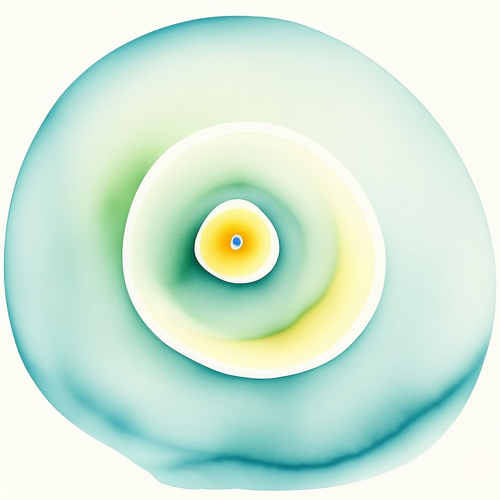
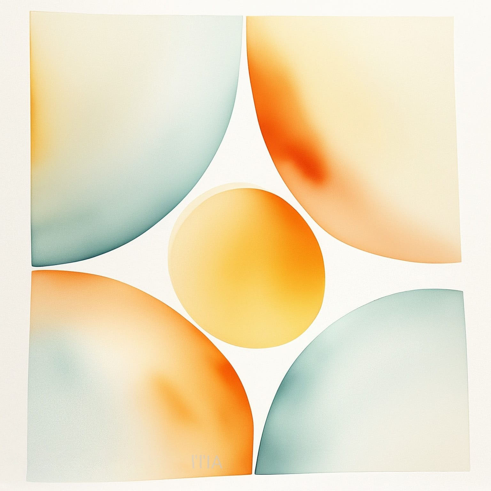
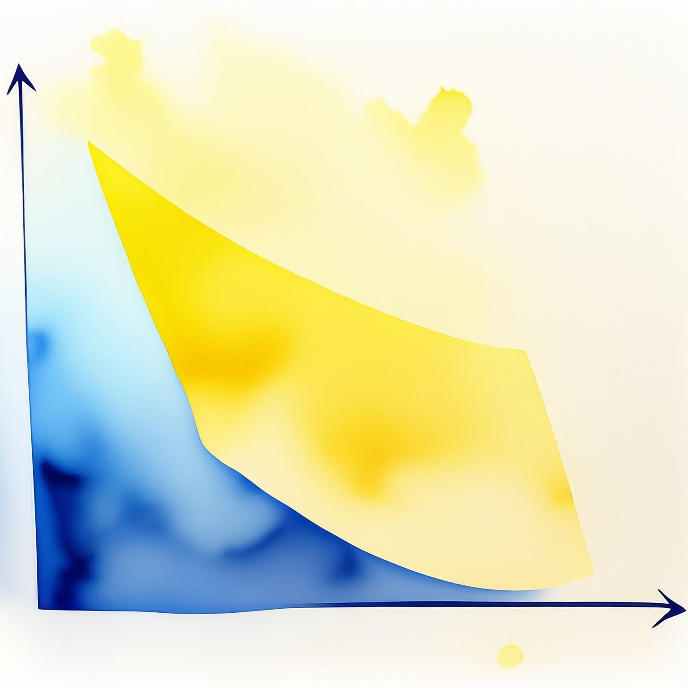

---
title: "Chimie générale"
subtitle: "Synthèse du cours de CHIM-F101"
toc: true
---

::: {.callout-warning appearance="minimal" collapse="true"}
## ⚠️ Avertissement concernant ces notes
Les notes publiées sur ce site sont basées sur ma compréhension personnelle du matériel et n'ont pas été indépendamment vérifiées. Bien que j'espère qu'elles soient utiles, il peut y avoir des erreurs ou des inexactitudes. Si vous trouvez des erreurs ou avez des suggestions d'amélioration, n'hésitez pas à me contacter : [a.d@csic.es](mailto:a.d@csic.es).
:::

**Enseignant :** Thierry Visart de Bocarmé (Année 2020-2021)  
**Ressources officielles :** 
[<i class="bi bi-link-45deg"></i> Page de l'ULB](https://www.ulb.be/fr/programme/chim-f101){.btn .btn-outline-light .btn-sm .ms-2}
[<i class="bi bi-folder2-open"></i> Espace Dochub](https://dochub.be/catalog/course/chim-f101){.btn .btn-outline-light .btn-sm .ms-2}

---

## Table des matières

::: {.grid}

<!-- CHAPITRE 0 -->
::: {.g-col-12 .g-col-md-4}
::: {.p-3 .rounded .shadow-sm style="background-color: var(--card-bg); border: 1px solid var(--border-flat); height: 100%; display: flex; flex-direction: column;"}
### Chapitre 0 : Introduction
{.rounded .mb-3 style="width: 100%; height: auto;"}

*Introduction aux concepts généraux de la chimie.*

[<i class="bi bi-file-earmark-pdf"></i> Notes du Chapitre 0](./assets/CHIM/CHIM - CH0.pdf){.btn-surface .c-emerald .w-100 style="margin-top: auto; min-height: 40px; height: auto; padding: 8px 12px; font-size: 0.9em;"}
:::
:::

<!-- CHAPITRE 1 -->
::: {.g-col-12 .g-col-md-4}
::: {.p-3 .rounded .shadow-sm style="background-color: var(--card-bg); border: 1px solid var(--border-flat); height: 100%; display: flex; flex-direction: column;"}
### Chapitre 1 : Notions fondamentales
{.rounded .mb-3 style="width: 100%; height: auto;"}

* **1.1** Définitions ${}^A_Z X$
* **1.2** Nomenclature
* **1.3** Solution aqueuse
* **1.4 Réactions chimiques et Stœchiométrie**
  * 1.4.1 Réaction de précipitation
  * 1.4.2 Réaction acide-base
  * 1.4.3 Réaction d’oxydoréduction

[<i class="bi bi-file-earmark-pdf"></i> Notes du Chapitre 1](./assets/CHIM/CHIM - CH1.pdf){.btn-surface .c-emerald .w-100 style="margin-top: auto; min-height: 40px; height: auto; padding: 8px 12px; font-size: 0.9em;"}
:::
:::

<!-- CHAPITRE 2 -->
::: {.g-col-12 .g-col-md-4}
::: {.p-3 .rounded .shadow-sm style="background-color: var(--card-bg); border: 1px solid var(--border-flat); height: 100%; display: flex; flex-direction: column;"}
### Chapitre 2 : Structure atomique
{.rounded .mb-3 style="width: 100%; height: auto;"}

* **2.1 L’étude des atomes**
  * Modèle nucléaire, Spectres
* **2.2 Le monde quantique**
  * Quanta, dualité, Heisenberg, fonctions d’onde
* **2.3 Orbitales atomiques $\Psi$**
  * Nombres quantiques $n, l, m_l, m_s$
* **2.4 Propriétés périodiques**
  * Rayon, ionisation, électronégativité $\chi$

[<i class="bi bi-file-earmark-pdf"></i> Notes du Chapitre 2](./assets/CHIM/CHIM - CH2.pdf){.btn-surface .c-emerald .w-100 style="margin-top: auto; min-height: 40px; height: auto; padding: 8px 12px; font-size: 0.9em;"}
:::
:::

<!-- CHAPITRE 3 -->
::: {.g-col-12 .g-col-md-4}
::: {.p-3 .rounded .shadow-sm style="background-color: var(--card-bg); border: 1px solid var(--border-flat); height: 100%; display: flex; flex-direction: column;"}
### Chapitre 3 : Structure moléculaire
{.rounded .mb-3 style="width: 100%; height: auto;"}

* **3.1 à 3.2 La liaison chimique** (Énergie, polarité, ionique, covalente...)
* **3.3 Règles de l’Octet et Lewis**
* **3.4 Modèle VSEPR**
* **3.5 Théorie du lien de valence**
* **3.6 Orbitales moléculaires**
* **3.7 Modèle du champ cristallin**
* **3.8 Spectroscopie moléculaire**

[<i class="bi bi-file-earmark-pdf"></i> Notes du Chapitre 3](./assets/CHIM/CHIM - CH3.pdf){.btn-surface .c-emerald .w-100 style="margin-top: auto; min-height: 40px; height: auto; padding: 8px 12px; font-size: 0.9em;"}
:::
:::

<!-- CHAPITRE 4 -->
::: {.g-col-12 .g-col-md-4}
::: {.p-3 .rounded .shadow-sm style="background-color: var(--card-bg); border: 1px solid var(--border-flat); height: 100%; display: flex; flex-direction: column;"}
### Chapitre 4 : État de la matière
{.rounded .mb-3 style="width: 100%; height: auto;"}

* **4.1 L’état gazeux**
  * Gaz parfait, théorie cinétique
* **4.2 L’état liquide**
  * Structures, viscosités, tensions
* **4.3 L’état solide**
  * 4.3.1 Arrangement cristallin
  * 4.3.2 Types de solides
  * 4.3.3 Interstices, défauts, alliages
  * 4.3.4 Énergie interne et capacité

[<i class="bi bi-file-earmark-pdf"></i> Notes du Chapitre 4](./assets/CHIM/CHIM - CH4.pdf){.btn-surface .c-emerald .w-100 style="margin-top: auto; min-height: 40px; height: auto; padding: 8px 12px; font-size: 0.9em;"}
:::
:::

<!-- CHAPITRE 5 -->
::: {.g-col-12 .g-col-md-4}
::: {.p-3 .rounded .shadow-sm style="background-color: var(--card-bg); border: 1px solid var(--border-flat); height: 100%; display: flex; flex-direction: column;"}
### Chapitre 5 : Principes de thermo
{.rounded .mb-3 style="width: 100%; height: auto;"}

* **5.1 Premier principe : conservation de l’énergie**
  * 5.1.1 Systèmes, états et énergies
  * 5.1.2 Enthalpie $H$
  * 5.1.3 Enthalpie chimique
* **5.2 Deuxième et troisième principe**
  * 5.2.1 Entropie $S$
  * 5.2.2 Variations globales d’entropie
  * 5.2.3 Enthalpie libre (Gibbs)

[<i class="bi bi-file-earmark-pdf"></i> Notes du Chapitre 5](./assets/CHIM/CHIM - CH5.pdf){.btn-surface .c-emerald .w-100 style="margin-top: auto; min-height: 40px; height: auto; padding: 8px 12px; font-size: 0.9em;"}
:::
:::

<!-- CHAPITRE 6 -->
::: {.g-col-12 .g-col-md-4}
::: {.p-3 .rounded .shadow-sm style="background-color: var(--card-bg); border: 1px solid var(--border-flat); height: 100%; display: flex; flex-direction: column;"}
### Chapitre 6 : Équilibre physique
{.rounded .mb-3 style="width: 100%; height: auto;"}

* **6.1 Phases et transitions**
  * Tension de vapeur, ébullition, diagramme de phase
* **6.2 Solubilité**
  * Saturation, loi de Henry, influence de la $T$
* **6.3 Propriétés colligatives**
  * Abaissement, cryoscopie, osmose
* **6.4 Mélanges binaires**
  * Distillation, Azéotrope, miscibilité

[<i class="bi bi-file-earmark-pdf"></i> Notes du Chapitre 6](./assets/CHIM/CHIM - CH6.pdf){.btn-surface .c-emerald .w-100 style="margin-top: auto; min-height: 40px; height: auto; padding: 8px 12px; font-size: 0.9em;"}
:::
:::

<!-- CHAPITRE 7 -->
::: {.g-col-12 .g-col-md-4}
::: {.p-3 .rounded .shadow-sm style="background-color: var(--card-bg); border: 1px solid var(--border-flat); height: 100%; display: flex; flex-direction: column;"}
### Chapitre 7 : Équilibre chimique
{.rounded .mb-3 style="width: 100%; height: auto;"}

* **7.3 Acide et base**
  * Définitions, acidité, constantes, calcul de pH, titrage
* **7.4 Équilibre de solubilité**
  * Produit de solubilité $\kappa_s$, modification
* **7.5 Réaction d’oxydoréduction**
  * Électrochimie, Pile, potentiel, Nernst

[<i class="bi bi-file-earmark-pdf"></i> Notes du Chapitre 7](./assets/CHIM/CHIM - CH7.pdf){.btn-surface .c-emerald .w-100 style="margin-top: auto; min-height: 40px; height: auto; padding: 8px 12px; font-size: 0.9em;"}
:::
:::

<!-- CHAPITRE 8 -->
::: {.g-col-12 .g-col-md-4}
::: {.p-3 .rounded .shadow-sm style="background-color: var(--card-bg); border: 1px solid var(--border-flat); height: 100%; display: flex; flex-direction: column;"}
### Chapitre 8 : Cinétique chimique
{.rounded .mb-3 style="width: 100%; height: auto;"}

* **8.1 Concentration et vitesse**
* **8.2 Loi des vitesses**
  * Ordres de réaction (0, 1, 2) et modèle des collisions
* **8.3 Mécanismes réactionnels**
  * Vitesse, équilibre, influence de $T$
* **8.4 Catalyse et sélectivité**
  * Homogène, enzymatique, hétérogène

[<i class="bi bi-file-earmark-pdf"></i> Notes du Chapitre 8](./assets/CHIM/CHIM - CH8.pdf){.btn-surface .c-emerald .w-100 style="margin-top: auto; min-height: 40px; height: auto; padding: 8px 12px; font-size: 0.9em;"}
:::
:::

:::