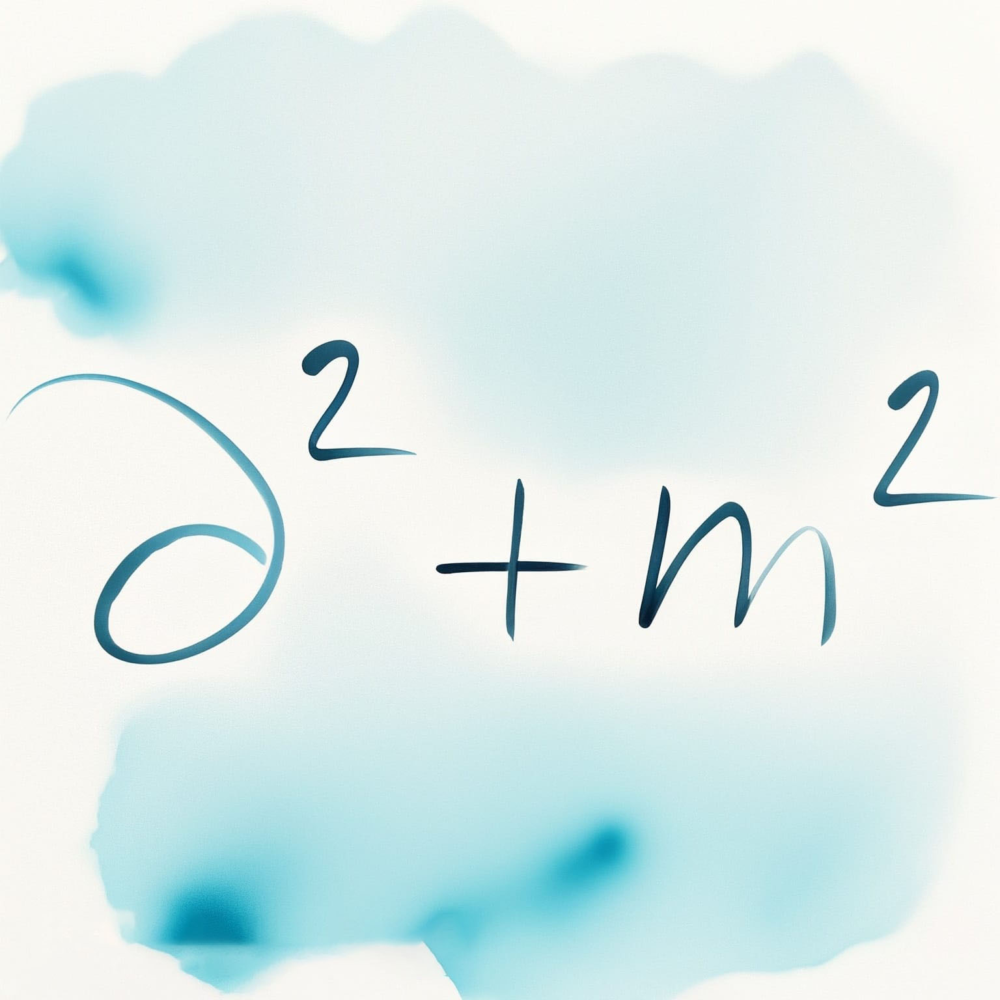
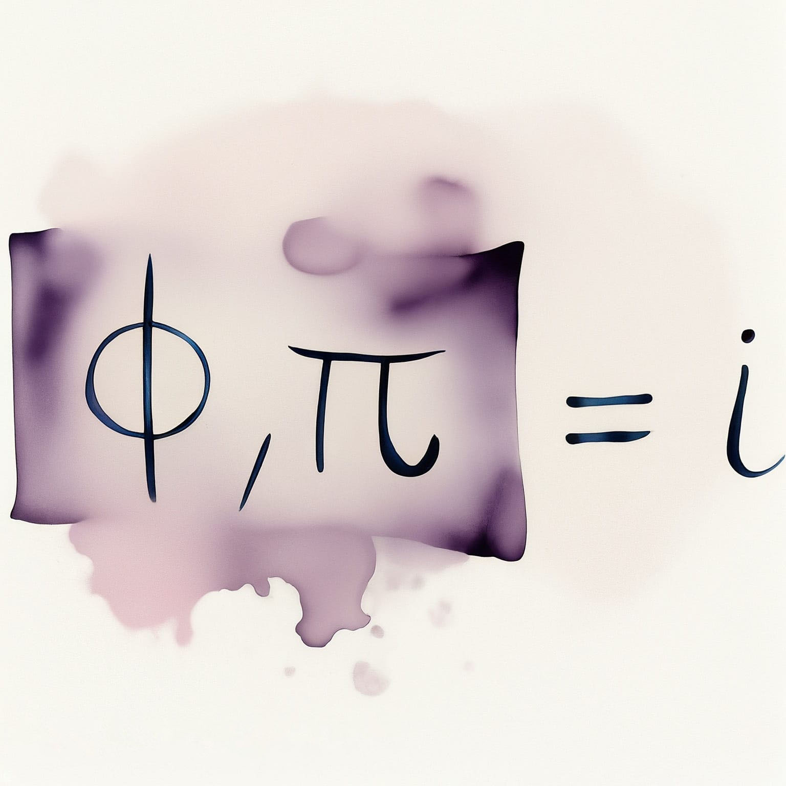

---
title: "Quantum Field Theory I"
subtitle: "Summary of the course PHYS-F410"
toc: true
---

::: {.callout-warning appearance="minimal" collapse="true"}
## ⚠️ Warning regarding these notes
The notes published on this website are based on my personal understanding of the material and have not been independently verified. While I hope they are helpful, there may be errors or inaccuracies. If you find any errors or have suggestions for improvement, please feel free to contact me: [a.d@csic.es](mailto:a.d@csic.es).
:::

**Teacher:** Petr TINIAKOV (Year 2023-2024)  
**Official resources:** [<i class="bi bi-link-45deg"></i> ULB page](https://www.ulb.be/en/programme/phys-f410-1){.btn .btn-outline-light .btn-sm .ms-2}
[<i class="bi bi-folder2-open"></i> Dochub space](https://dochub.be/catalog/course/phys-f410){.btn .btn-outline-light .btn-sm .ms-2}

---

## Table of Contents

::: {.grid}

::: {.g-col-12 .g-col-md-4}
::: {.p-3 .rounded .shadow-sm style="background-color: var(--card-bg); border: 1px solid var(--border-flat); height: 100%; display: flex; flex-direction: column;"}
### Chapter 1: Classical Field
{.rounded .mb-3 style="width: 100%; height: auto;"}

* **1.1 Scalar field**
* **1.2 Symmetries and conservation laws: Noether theorem**
* **1.3 Energy-momentum tensor**

[<i class="bi bi-file-earmark-pdf"></i> Chapter 1 Notes](./assets/QFT1/QFT1-CH1.pdf){.btn-surface .c-teal .w-100 style="margin-top: auto; min-height: 40px; height: auto; padding: 8px 12px; font-size: 0.9em;"}
:::
:::

::: {.g-col-12 .g-col-md-4}
::: {.p-3 .rounded .shadow-sm style="background-color: var(--card-bg); border: 1px solid var(--border-flat); height: 100%; display: flex; flex-direction: column;"}
### Chapter 2: Quantization of a Free Scalar Field
{.rounded .mb-3 style="width: 100%; height: auto;"}

* **2.1 Quantization in quantum mechanics**
* **2.2 Quantization of a real scalar field**
* **2.3 Complex scalar field**

[<i class="bi bi-file-earmark-pdf"></i> Chapter 2 Notes](./assets/QFT1/QFT1-CH2.pdf){.btn-surface .c-teal .w-100 style="margin-top: auto; min-height: 40px; height: auto; padding: 8px 12px; font-size: 0.9em;"}
:::
:::

::: {.g-col-12 .g-col-md-4}
::: {.p-3 .rounded .shadow-sm style="background-color: var(--card-bg); border: 1px solid var(--border-flat); height: 100%; display: flex; flex-direction: column;"}
### Chapter 3: Interaction
{.rounded .mb-3 style="width: 100%; height: auto;"}

* **3.1 Interaction representation**
* **3.2 Evolution in interaction representation**
* **3.3 Matrix Elements of the S-Matrix**
* **3.4 Calculation of the S-Matrix**
* **3.5 Decay of a massive particle**
* **3.6 Scattering and Cross section**

[<i class="bi bi-file-earmark-pdf"></i> Chapter 3 Notes](./assets/QFT1/QFT1-CH3.pdf){.btn-surface .c-teal .w-100 style="margin-top: auto; min-height: 40px; height: auto; padding: 8px 12px; font-size: 0.9em;"}
:::
:::

::: {.g-col-12 .g-col-md-4}
::: {.p-3 .rounded .shadow-sm style="background-color: var(--card-bg); border: 1px solid var(--border-flat); height: 100%; display: flex; flex-direction: column;"}
### Chapter 4: Free Dirac Field
{.rounded .mb-3 style="width: 100%; height: auto;"}

* **4.1 Spinor representation**
* **4.2 Lagrangian of a free Dirac field**
* **4.3 Solution to the free Dirac equation**
* **4.4 Quantization**
* **4.5 Spin**
* **4.6 One-particle states**
* **4.7 Statistics**

[<i class="bi bi-file-earmark-pdf"></i> Chapter 4 Notes](./assets/QFT1/QFT1-CH4.pdf){.btn-surface .c-teal .w-100 style="margin-top: auto; min-height: 40px; height: auto; padding: 8px 12px; font-size: 0.9em;"}
:::
:::

::: {.g-col-12 .g-col-md-4}
::: {.p-3 .rounded .shadow-sm style="background-color: var(--card-bg); border: 1px solid var(--border-flat); height: 100%; display: flex; flex-direction: column;"}
### Chapter 5: Vector Field
{.rounded .mb-3 style="width: 100%; height: auto;"}

* **5.1 Construct a Lagrangian**
* **5.2 Classical solutions**
* **5.3 Canonical quantization**

[<i class="bi bi-file-earmark-pdf"></i> Chapter 5 Notes](./assets/QFT1/QFT1-CH5.pdf){.btn-surface .c-teal .w-100 style="margin-top: auto; min-height: 40px; height: auto; padding: 8px 12px; font-size: 0.9em;"}
:::
:::

::: {.g-col-12 .g-col-md-4}
::: {.p-3 .rounded .shadow-sm style="background-color: var(--card-bg); border: 1px solid var(--border-flat); height: 100%; display: flex; flex-direction: column;"}
### Chapter 6: Feynman Rules for Fermions and Vectors
{.rounded .mb-3 style="width: 100%; height: auto;"}

* **6.1 Feynman rules for fermions**
* **6.2 Feynman rules for vectors**
* **6.3 Decay of a vector into two fermions**

[<i class="bi bi-file-earmark-pdf"></i> Chapter 6 Notes](./assets/QFT1/QFT1-CH6.pdf){.btn-surface .c-teal .w-100 style="margin-top: auto; min-height: 40px; height: auto; padding: 8px 12px; font-size: 0.9em;"}
:::
:::

:::