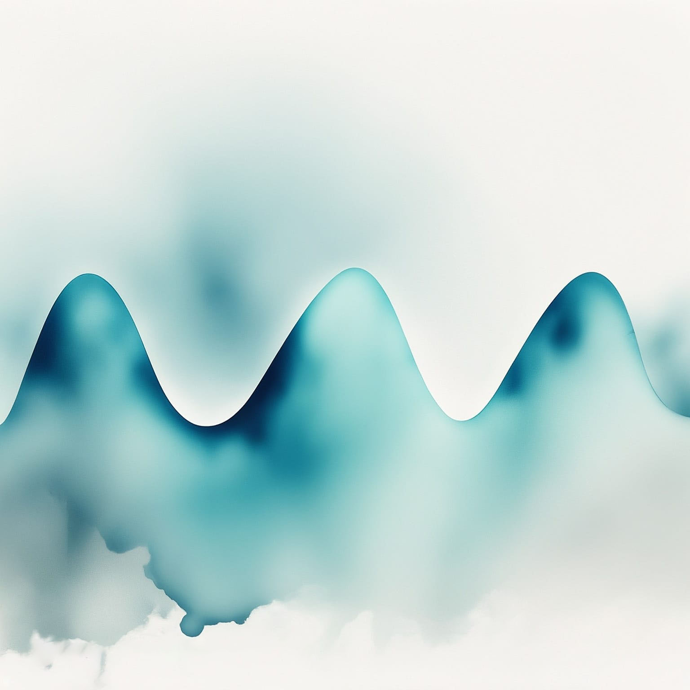
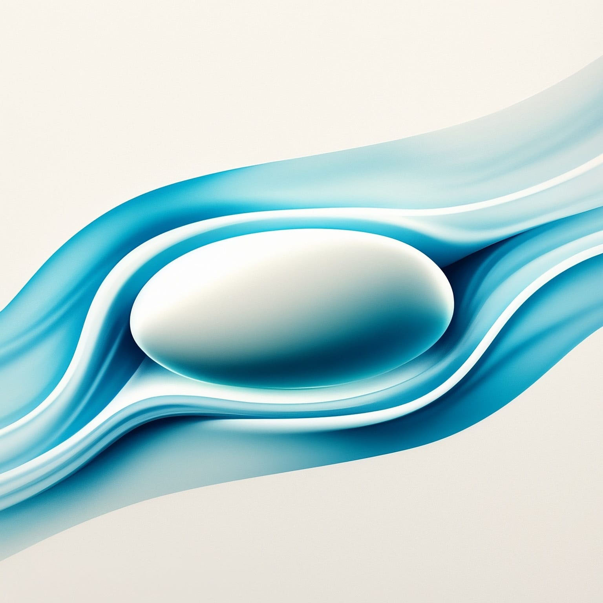

---
title: "Dynamique des fluides et des plasmas"
subtitle: "Synthèse du cours de PHYS-F412"
toc: true
---

::: {.callout-warning appearance="minimal" collapse="true"}
## ⚠️ Avertissement concernant ces notes
Les notes publiées sur ce site sont basées sur ma compréhension personnelle du matériel et n'ont pas été indépendamment vérifiées. Bien que j'espère qu'elles soient utiles, il peut y avoir des erreurs ou des inexactitudes. Si vous trouvez des erreurs ou avez des suggestions d'amélioration, n'hésitez pas à me contacter : [a.d@csic.es](mailto:a.d@csic.es).
:::

**Enseignant :** Bernard KNAEPEN (Année 2023 - 2024)  
**Ressources officielles :** 
[<i class="bi bi-link-45deg"></i> Page de l'ULB](https://www.ulb.be/fr/programme/phys-f412){.btn .btn-outline-light .btn-sm .ms-2}
[<i class="bi bi-folder2-open"></i> Espace Dochub](https://dochub.be/catalog/course/phys-f412){.btn .btn-outline-light .btn-sm .ms-2}

---

## Table des matières

::: {.grid}

<!-- Chapitre 1 -->
::: {.g-col-12 .g-col-md-4}
::: {.p-3 .rounded .shadow-sm style="background-color: var(--card-bg); border: 1px solid var(--border-flat); height: 100%; display: flex; flex-direction: column;"}
### Chapitre 1 : Description d'un fluide
{.rounded .mb-3 style="width: 100%; height: auto;"}

* **1.1 Introduction**
* **1.2 Définitions et notions préliminaires**
* **1.3 Équation du mouvement pour un fluide idéal**
* **1.4 Vorticité**

[<i class="bi bi-file-earmark-pdf"></i> Notes du Chapitre 1](./assets/PLASMA/PLASMA - CH1.pdf){.btn-surface .c-teal .w-100 style="margin-top: auto; min-height: 40px; height: auto; padding: 8px 12px; font-size: 0.9em;"}
:::
:::

<!-- Chapitre 2 -->
::: {.g-col-12 .g-col-md-4}
::: {.p-3 .rounded .shadow-sm style="background-color: var(--card-bg); border: 1px solid var(--border-flat); height: 100%; display: flex; flex-direction: column;"}
### Chapitre 2 : Fluides visqueux
{.rounded .mb-3 style="width: 100%; height: auto;"}

* **2.1 Introduction**
* **2.2 Navier-Stokes**
* **2.3 Écoulements visqueux simples**
* **2.4 Écoulements axisymétriques**

[<i class="bi bi-file-earmark-pdf"></i> Notes du Chapitre 2](./assets/PLASMA/PLASMA - CH2.pdf){.btn-surface .c-teal .w-100 style="margin-top: auto; min-height: 40px; height: auto; padding: 8px 12px; font-size: 0.9em;"}
:::
:::

<!-- Chapitre 3 -->
::: {.g-col-12 .g-col-md-4}
::: {.p-3 .rounded .shadow-sm style="background-color: var(--card-bg); border: 1px solid var(--border-flat); height: 100%; display: flex; flex-direction: column;"}
### Chapitre 3 : Vagues
{.rounded .mb-3 style="width: 100%; height: auto;"}

* **3.1 Introduction**
* **3.2 Vagues en eau profonde**

[<i class="bi bi-file-earmark-pdf"></i> Notes du Chapitre 3](./assets/PLASMA/PLASMA - CH3.pdf){.btn-surface .c-teal .w-100 style="margin-top: auto; min-height: 40px; height: auto; padding: 8px 12px; font-size: 0.9em;"}
:::
:::

<!-- Chapitre 4 -->
::: {.g-col-12 .g-col-md-4}
::: {.p-3 .rounded .shadow-sm style="background-color: var(--card-bg); border: 1px solid var(--border-flat); height: 100%; display: flex; flex-direction: column;"}
### Chapitre 4 : Portance
{.rounded .mb-3 style="width: 100%; height: auto;"}

* **4.1 Introduction**
* **4.2 Potentiel et fonction de courant**
* **4.3 Potentiel complexe**
* **4.4 Méthode des images**
* **4.5 Écoulement irrotationnel autour d'un cylindre**
* **4.6 Transformation conforme**
* **4.7 Écoulement autour d'une aile symétrique**
* **4.8 Théorème de Blasius**
* **4.9 Théorème de la portance de Kutta-Joukowski**

[<i class="bi bi-file-earmark-pdf"></i> Notes du Chapitre 4](./assets/PLASMA/PLASMA - CH4.pdf){.btn-surface .c-teal .w-100 style="margin-top: auto; min-height: 40px; height: auto; padding: 8px 12px; font-size: 0.9em;"}
:::
:::

<!-- Chapitre 5 -->
::: {.g-col-12 .g-col-md-4}
::: {.p-3 .rounded .shadow-sm style="background-color: var(--card-bg); border: 1px solid var(--border-flat); height: 100%; display: flex; flex-direction: column;"}
### Chapitre 5 : Instabilités hydrodynamiques
{.rounded .mb-3 style="width: 100%; height: auto;"}

* **5.1 Instabilité de Rayleigh-Bénard**
* **5.2 Instabilité de Taylor-Couette**

[<i class="bi bi-file-earmark-pdf"></i> Notes du Chapitre 5](./assets/PLASMA/PLASMA - CH5.pdf){.btn-surface .c-teal .w-100 style="margin-top: auto; min-height: 40px; height: auto; padding: 8px 12px; font-size: 0.9em;"}
:::
:::

<!-- Chapitre 6 -->
::: {.g-col-12 .g-col-md-4}
::: {.p-3 .rounded .shadow-sm style="background-color: var(--card-bg); border: 1px solid var(--border-flat); height: 100%; display: flex; flex-direction: column;"}
### Chapitre 6 : Magnétohydrodynamique
{.rounded .mb-3 style="width: 100%; height: auto;"}

* **6.1 Force de Lorentz sur un fluide**
* **6.2 Loi d'Ampère-Maxwell**
* **6.3 Équation d'induction magnétique**
* **6.4 Adimensionnement des équations**
* **6.5 Écoulement de Hartmann**
* **6.6 Onde Alfvén**
* **6.7 Reconnexion magnétique**

[<i class="bi bi-file-earmark-pdf"></i> Notes du Chapitre 6](./assets/PLASMA/PLASMA - CH6.pdf){.btn-surface .c-teal .w-100 style="margin-top: auto; min-height: 40px; height: auto; padding: 8px 12px; font-size: 0.9em;"}
:::
:::

:::

---

## Ressources du cours

### Exercices
* [TP1 : Introduction](./assets/PLASMA/TPs/TP1 Introduction.pdf)
* [TP2 : Écoulement visqueux élémentaire](./assets/PLASMA/TPs/TP2 Elementary Viscous Flow.pdf)
* [TP3 : Vagues](./assets/PLASMA/TPs/TP3 Waves.pdf)
* [TP4 : Théorie des profils aérodynamiques](./assets/PLASMA/TPs/TP4 Aerofoil Theory.pdf)
* [TP5 : Instabilités](./assets/PLASMA/TPs/TP5 Instability.pdf)
* [TP6 : Magnétohydrodynamique](./assets/PLASMA/TPs/TP6 MHD.pdf)