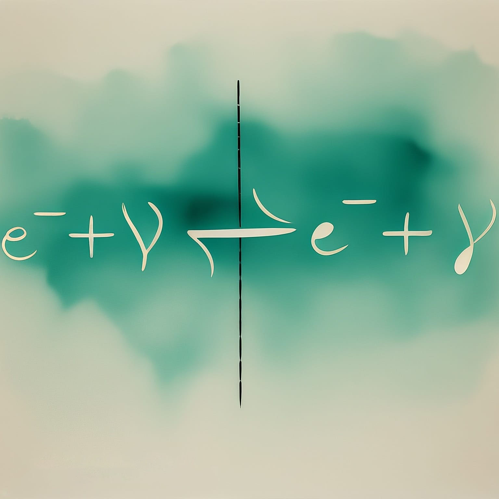
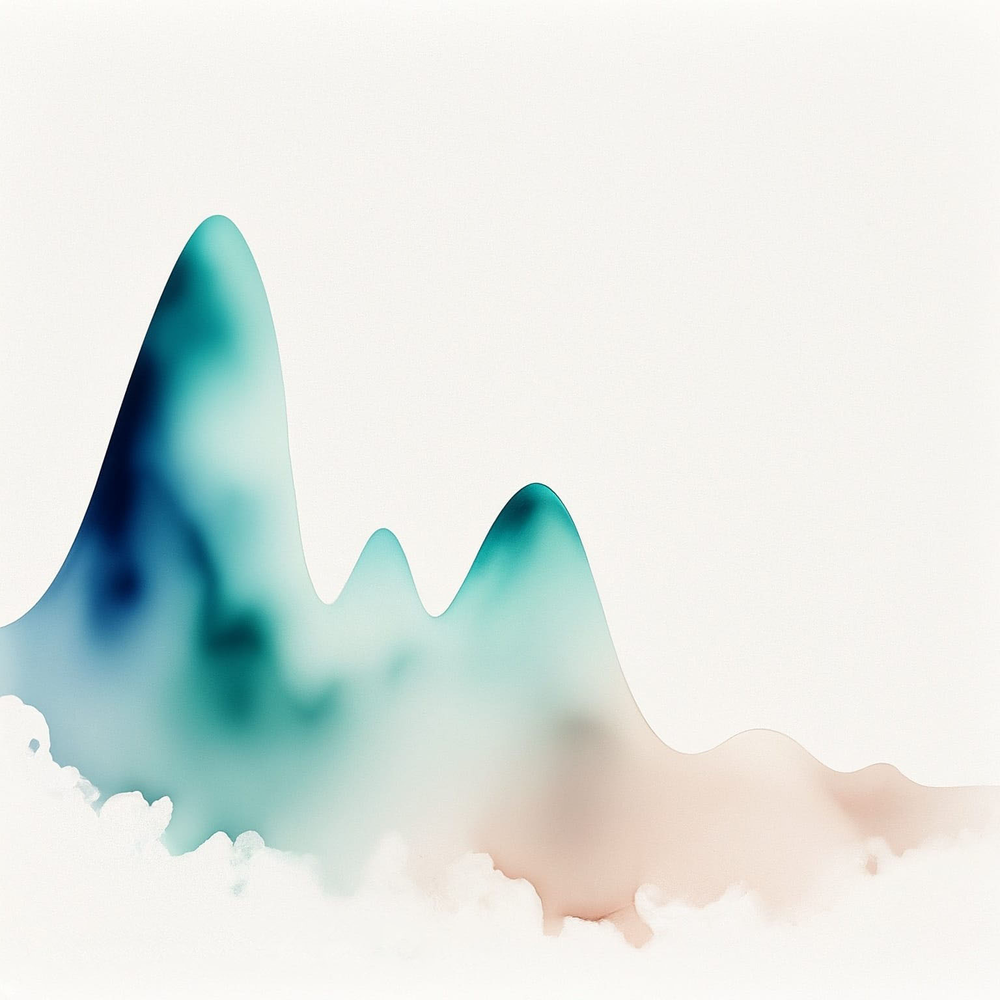

---
title: "Cosmologie"
subtitle: "Synthèse du cours de PHYS-F415"
toc: true
---

::: {.callout-warning appearance="minimal" collapse="true"}
## ⚠️ Avertissement concernant ces notes
Les notes publiées sur ce site sont basées sur ma compréhension personnelle du matériel et n'ont pas été indépendamment vérifiées. Bien que j'espère qu'elles soient utiles, il peut y avoir des erreurs ou des inexactitudes. Si vous trouvez des erreurs ou avez des suggestions d'amélioration, n'hésitez pas à me contacter : [a.d@csic.es](mailto:a.d@csic.es).
:::

**Enseignant :** Thomas HAMBYE (Année 2023-2024)  
**Ressources officielles :** [<i class="bi bi-link-45deg"></i> Page de l'ULB](https://www.ulb.be/fr/programme/phys-f415-1){.btn .btn-outline-light .btn-sm .ms-2}
[<i class="bi bi-folder2-open"></i> Espace Dochub](https://dochub.be/catalog/course/phys-f415){.btn .btn-outline-light .btn-sm .ms-2}

---

## Table des matières

::: {.grid}

::: {.g-col-12 .g-col-md-4}
::: {.p-3 .rounded .shadow-sm style="background-color: var(--card-bg); border: 1px solid var(--border-flat); height: 100%; display: flex; flex-direction: column;"}
### Chapitre 1 : Univers homotrope : géométrie, distance et horizon
{.rounded .mb-3 style="width: 100%; height: auto;"}

* **1.1 Échelles de grandeurs**
* **1.2 Principe cosmologique et loi de Hubble**
* **1.3 Géométrie d'un space homotrope**
* **1.4 Horizons**

[<i class="bi bi-file-earmark-pdf"></i> Notes du Chapitre 1](./assets/COSMO/COSMO - CH1.pdf){.btn-surface .c-purple .w-100 style="margin-top: auto; min-height: 40px; height: auto; padding: 8px 12px; font-size: 0.9em;"}
:::
:::

::: {.g-col-12 .g-col-md-4}
::: {.p-3 .rounded .shadow-sm style="background-color: var(--card-bg); border: 1px solid var(--border-flat); height: 100%; display: flex; flex-direction: column;"}
### Chapitre 2 : Dynamique d'un univers homotrope
{.rounded .mb-3 style="width: 100%; height: auto;"}

* **2.1 Dynamique de Newton**
* **2.2 Dynamique de la relativité générale**
* **2.3 Solutions aux équations de Friedmann**
* **2.4 Ajustement du modèle à partir des données**
* **2.5 Univers de Milne**

[<i class="bi bi-file-earmark-pdf"></i> Notes du Chapitre 2](./assets/COSMO/COSMO - CH2.pdf){.btn-surface .c-purple .w-100 style="margin-top: auto; min-height: 40px; height: auto; padding: 8px 12px; font-size: 0.9em;"}
:::
:::

::: {.g-col-12 .g-col-md-4}
::: {.p-3 .rounded .shadow-sm style="background-color: var(--card-bg); border: 1px solid var(--border-flat); height: 100%; display: flex; flex-direction: column;"}
### Chapitre 3 : Univers primordial
{.rounded .mb-3 style="width: 100%; height: auto;"}

* **3.1 Égalité matière - $\Lambda$ et matière - radiation**
* **3.2 Époque dominée par la radiation**
* **3.3 Entropie**
* **3.4 Particule non relativiste en équilibre thermique**
* **3.5 Découplage chimique d'un type de particule**
* **3.6 Découplage des neutrinos**
* **3.7 Ratio baryon-photon**
* **3.8 Brève histoire de l'univers**

[<i class="bi bi-file-earmark-pdf"></i> Notes du Chapitre 3](./assets/COSMO/COSMO - CH3.pdf){.btn-surface .c-purple .w-100 style="margin-top: auto; min-height: 40px; height: auto; padding: 8px 12px; font-size: 0.9em;"}
:::
:::

::: {.g-col-12 .g-col-md-4}
::: {.p-3 .rounded .shadow-sm style="background-color: var(--card-bg); border: 1px solid var(--border-flat); height: 100%; display: flex; flex-direction: column;"}
### Chapitre 4 : Nucléosynthèse primordiale
{.rounded .mb-3 style="width: 100%; height: auto;"}

* **4.1 Équilibre statistique nucléaire**
* **4.2 Rapport neutron-proton**
* **4.3 Chaînes de réactions nucléaires**
* **4.4 Barrière de Coulomb**
* **4.5 Chronologie de la nucléosynthèse primordiale**

[<i class="bi bi-file-earmark-pdf"></i> Notes du Chapitre 4](./assets/COSMO/COSMO - CH4.pdf){.btn-surface .c-purple .w-100 style="margin-top: auto; min-height: 40px; height: auto; padding: 8px 12px; font-size: 0.9em;"}
:::
:::

::: {.g-col-12 .g-col-md-4}
::: {.p-3 .rounded .shadow-sm style="background-color: var(--card-bg); border: 1px solid var(--border-flat); height: 100%; display: flex; flex-direction: column;"}
### Chapitre 5 : Recombinaison et découplage des photons
{.rounded .mb-3 style="width: 100%; height: auto;"}

* **5.1 Recombinaison**
* **5.2 Découplage cinétique des photons**
* **5.3 Commentaires**

[<i class="bi bi-file-earmark-pdf"></i> Notes du Chapitre 5](./assets/COSMO/COSMO - CH5.pdf){.btn-surface .c-purple .w-100 style="margin-top: auto; min-height: 40px; height: auto; padding: 8px 12px; font-size: 0.9em;"}
:::
:::

::: {.g-col-12 .g-col-md-4}
::: {.p-3 .rounded .shadow-sm style="background-color: var(--card-bg); border: 1px solid var(--border-flat); height: 100%; display: flex; flex-direction: column;"}
### Chapitre 6 : Matière noire
{.rounded .mb-3 style="width: 100%; height: auto;"}

* **6.1 Indications**
* **6.2 Nature de la matière noire**
* **6.3 Densité relique de la matière noire**
* **6.4 Densité relique et équation de Boltzmann**

[<i class="bi bi-file-earmark-pdf"></i> Notes du Chapitre 6](./assets/COSMO/COSMO - CH6.pdf){.btn-surface .c-purple .w-100 style="margin-top: auto; min-height: 40px; height: auto; padding: 8px 12px; font-size: 0.9em;"}
:::
:::

::: {.g-col-12 .g-col-md-4}
::: {.p-3 .rounded .shadow-sm style="background-color: var(--card-bg); border: 1px solid var(--border-flat); height: 100%; display: flex; flex-direction: column;"}
### Chapitre 7 : Origine de l'asymétrie matière - anti-matière dans l'univers
{.rounded .mb-3 style="width: 100%; height: auto;"}

* **7.1 Généralités**
* **7.2 Exemple de baryogénèse : désintégration**
* **7.3 Asymétrie $CP$**
* **7.4 Brisure explicite de $B$**
* **7.5 Condition de déséquilibre thermique**
* **7.6 Équation de Boltzmann**

[<i class="bi bi-file-earmark-pdf"></i> Notes du Chapitre 7](./assets/COSMO/COSMO - CH7.pdf){.btn-surface .c-purple .w-100 style="margin-top: auto; min-height: 40px; height: auto; padding: 8px 12px; font-size: 0.9em;"}
:::
:::

::: {.g-col-12 .g-col-md-4}
::: {.p-3 .rounded .shadow-sm style="background-color: var(--card-bg); border: 1px solid var(--border-flat); height: 100%; display: flex; flex-direction: column;"}
### Chapitre 8 : Inflation
{.rounded .mb-3 style="width: 100%; height: auto;"}

* **8.1 Critique de $\Lambda$-CDM**
* **8.2 Principe de l'inflation**
* **8.3 Dynamique du champ scalaire**

[<i class="bi bi-file-earmark-pdf"></i> Notes du Chapitre 8](./assets/COSMO/COSMO - CH8.pdf){.btn-surface .c-purple .w-100 style="margin-top: auto; min-height: 40px; height: auto; padding: 8px 12px; font-size: 0.9em;"}
:::
:::

:::