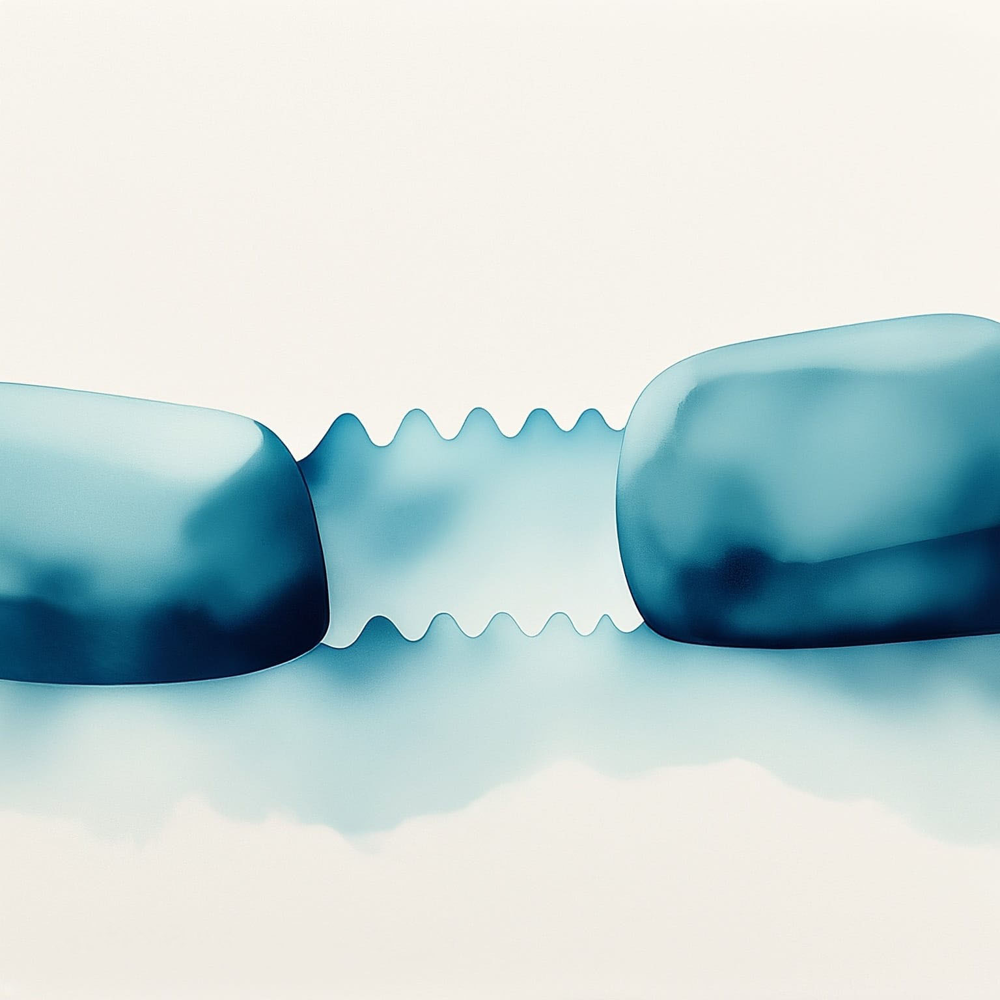
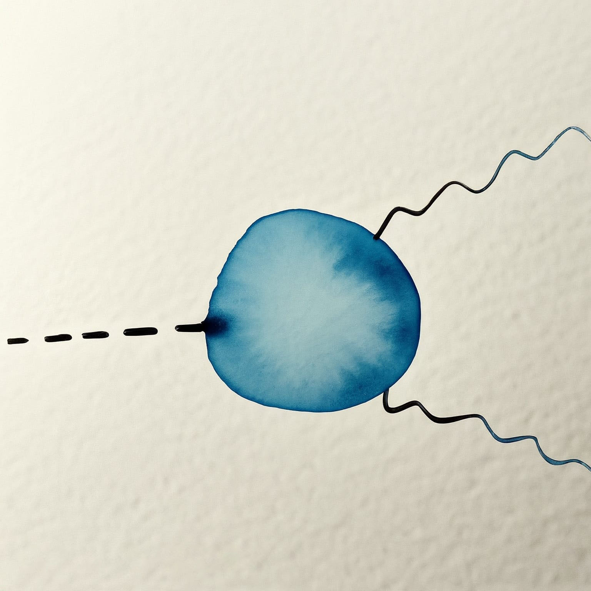
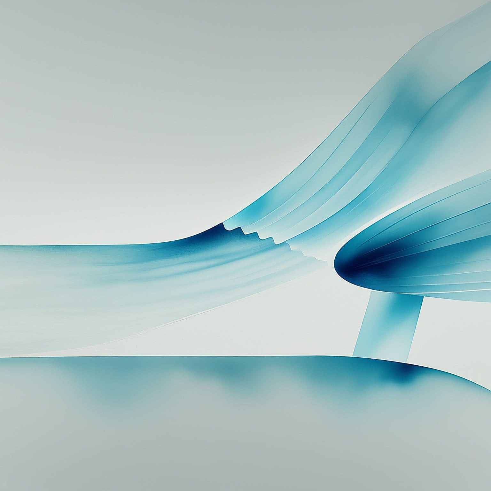
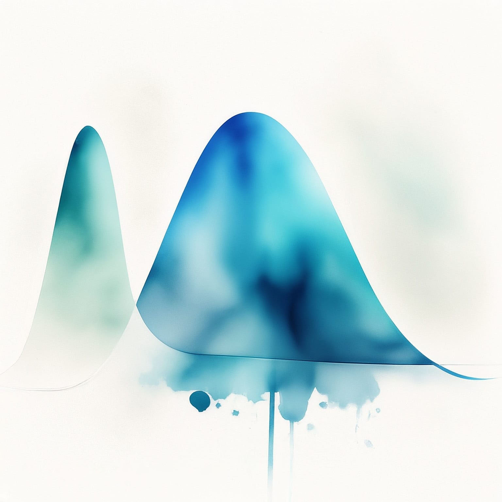

---
title: "Physique des particules"
subtitle: "Synthèse du cours de PHYS-F416"
toc: true
---

::: {.callout-warning appearance="minimal" collapse="true"}
## ⚠️ Avertissement concernant ces notes
Les notes publiées sur ce site sont basées sur ma compréhension personnelle du matériel et n'ont pas été indépendamment vérifiées. Bien que j'espère qu'elles soient utiles, il peut y avoir des erreurs ou des inexactitudes. Si vous trouvez des erreurs ou avez des suggestions d'amélioration, n'hésitez pas à me contacter : [a.d@csic.es](mailto:a.d@csic.es).
:::

**Enseignant :** Barbara CLERBAUX (Année 2023-2024)  
**Ressources officielles :** 
[<i class="bi bi-link-45deg"></i> Page de l'ULB](https://www.ulb.be/fr/programme/phys-f416){.btn .btn-outline-light .btn-sm .ms-2}
[<i class="bi bi-folder2-open"></i> Espace Dochub](https://dochub.be/catalog/course/phys-f416){.btn .btn-outline-light .btn-sm .ms-2}

---

## Table des matières

::: {.grid}

<!-- CHAPITRE 1 -->
::: {.g-col-12 .g-col-md-4}
::: {.p-3 .rounded .shadow-sm style="background-color: var(--card-bg); border: 1px solid var(--border-flat); height: 100%; display: flex; flex-direction: column;"}
### Chapitre 1 : Introduction et rappels
{.rounded .mb-3 style="width: 100%; height: auto;"}

* **1.1 Physique des particules élémentaires**
* **1.2 Particules élémentaires de la matière**
* **1.3 Interactions fondamentales**
* **1.4 Modèle standard de la physique des particules**

[<i class="bi bi-file-earmark-pdf"></i> Notes du Chapitre 1](./assets/PART2/PART2 - CH1.pdf){.btn-surface .c-teal .w-100 style="margin-top: auto; min-height: 40px; height: auto; padding: 8px 12px; font-size: 0.9em;"}
:::
:::

<!-- CHAPITRE 2 -->
::: {.g-col-12 .g-col-md-4}
::: {.p-3 .rounded .shadow-sm style="background-color: var(--card-bg); border: 1px solid var(--border-flat); height: 100%; display: flex; flex-direction: column;"}
### Chapitre 2 : Symétries et lois de conservation
{.rounded .mb-3 style="width: 100%; height: auto;"}

* **2.1 Théorème de Noether**
* **2.2 Symétries continues**
* **2.3 Symétries internes**
* **2.4 Symétries discrètes**

[<i class="bi bi-file-earmark-pdf"></i> Notes du Chapitre 2](./assets/PART2/PART2 - CH2.pdf){.btn-surface .c-teal .w-100 style="margin-top: auto; min-height: 40px; height: auto; padding: 8px 12px; font-size: 0.9em;"}
:::
:::

<!-- CHAPITRE 3 -->
::: {.g-col-12 .g-col-md-4}
::: {.p-3 .rounded .shadow-sm style="background-color: var(--card-bg); border: 1px solid var(--border-flat); height: 100%; display: flex; flex-direction: column;"}
### Chapitre 3 : Modélisation des interactions fondamentales
{.rounded .mb-3 style="width: 100%; height: auto;"}

* **3.1 Nécessité d'une théorie quantique des champs**
* **3.2 Premières tentatives**
* **3.3 Ingrédients d'une théorie quantique des champs**
* **3.4 Formalisme du lagrangien en TQC**
* **3.5 Symétrie de jauge locale**
* **3.6 Calcul des amplitudes de transitions**
* **3.7 Calcul du taux de désintégration**
* **3.8 Résumé**

[<i class="bi bi-file-earmark-pdf"></i> Notes du Chapitre 3](./assets/PART2/PART2 - CH3.pdf){.btn-surface .c-teal .w-100 style="margin-top: auto; min-height: 40px; height: auto; padding: 8px 12px; font-size: 0.9em;"}
:::
:::

<!-- CHAPITRE 4 -->
::: {.g-col-12 .g-col-md-4}
::: {.p-3 .rounded .shadow-sm style="background-color: var(--card-bg); border: 1px solid var(--border-flat); height: 100%; display: flex; flex-direction: column;"}
### Chapitre 4 : Interactions faibles
{.rounded .mb-3 style="width: 100%; height: auto;"}

* **4.1 Introduction**
* **4.2 Opérateur parité $P$ sur spineur $\Psi$**
* **4.3 Conservation de la parité en QED/QCD**
* **4.4 Conséquence de la violation de $P$**
* **4.5 Structure en $V-A$**
* **4.6 Universalité leptonique**
* **4.7 Couplage faible et angle de Cabibbo**
* **4.8 Nécessité d'un $4^{\text{ème}}$ quark : le charme**
* **4.9 La matrice $CKM$**
* **4.10 Triangle d'unitarité**

[<i class="bi bi-file-earmark-pdf"></i> Notes du Chapitre 4](./assets/PART2/PART2 - CH4.pdf){.btn-surface .c-teal .w-100 style="margin-top: auto; min-height: 40px; height: auto; padding: 8px 12px; font-size: 0.9em;"}
:::
:::

<!-- CHAPITRE 5 -->
::: {.g-col-12 .g-col-md-4}
::: {.p-3 .rounded .shadow-sm style="background-color: var(--card-bg); border: 1px solid var(--border-flat); height: 100%; display: flex; flex-direction: column;"}
### Chapitre 5 : Interactions électrofaibles
{.rounded .mb-3 style="width: 100%; height: auto;"}

* **5.1 Introduction & courants neutres**
* **5.5 Contrainte d'unification**
* **5.6 Masse des bosons $W$ et $Z$**
* **5.8 LEP et SLC**
* **5.9 Tests de précision électrofaible**
* **5.10 Chiralité et unification**
* **5.12 Boson scalaire $H^0$**
* **5.13 Tevatron au LHC & CMS**
* **5.15 Observation du $H^0$ au LHC**

[<i class="bi bi-file-earmark-pdf"></i> Notes du Chapitre 5](./assets/PART2/PART2 - CH5.pdf){.btn-surface .c-teal .w-100 style="margin-top: auto; min-height: 40px; height: auto; padding: 8px 12px; font-size: 0.9em;"}
:::
:::

<!-- CHAPITRE 6 -->
::: {.g-col-12 .g-col-md-4}
::: {.p-3 .rounded .shadow-sm style="background-color: var(--card-bg); border: 1px solid var(--border-flat); height: 100%; display: flex; flex-direction: column;"}
### Chapitre 6 : Introduction à la violation $CP$
{.rounded .mb-3 style="width: 100%; height: auto;"}

* **6.1 Introduction et modèle standard**
* **6.3 Système $K^0$-$\bar{K}^0$ et évolution temporelle**
* **6.5 Violation de $CP$ dans les désintégrations**
* **6.8 Désintégration des bosons $B^0$**
* **6.9 Résultats de LHCb & Conclusion**

[<i class="bi bi-file-earmark-pdf"></i> Notes du Chapitre 6](./assets/PART2/PART2 - CH6.pdf){.btn-surface .c-teal .w-100 style="margin-top: auto; min-height: 40px; height: auto; padding: 8px 12px; font-size: 0.9em;"}
:::
:::

<!-- CHAPITRE 7 -->
::: {.g-col-12 .g-col-md-4}
::: {.p-3 .rounded .shadow-sm style="background-color: var(--card-bg); border: 1px solid var(--border-flat); height: 100%; display: flex; flex-direction: column;"}
### Chapitre 7 : Oscillation des neutrinos
{.rounded .mb-3 style="width: 100%; height: auto;"}

* **7.1 Neutrinos $\nu$ du modèle standard**
* **7.2 Problème des neutrinos solaires**
* **7.3 Mélange des neutrinos**

[<i class="bi bi-file-earmark-pdf"></i> Notes du Chapitre 7](./assets/PART2/PART2 - CH7.pdf){.btn-surface .c-teal .w-100 style="margin-top: auto; min-height: 40px; height: auto; padding: 8px 12px; font-size: 0.9em;"}
:::
:::

<!-- CHAPITRE 8 -->
::: {.g-col-12 .g-col-md-4}
::: {.p-3 .rounded .shadow-sm style="background-color: var(--card-bg); border: 1px solid var(--border-flat); height: 100%; display: flex; flex-direction: column;"}
### Chapitre 8 : Oscillation des neutrinos solaires et atmosphériques
{.rounded .mb-3 style="width: 100%; height: auto;"}

* **8.1 Caractéristiques des sources et des détecteurs**
* **8.2 Expériences pour les $\nu$ solaires**
* **8.3 Détection des oscillations atmosphériques**
* **8.4 Résumé**

[<i class="bi bi-file-earmark-pdf"></i> Notes du Chapitre 8](./assets/PART2/PART2 - CH8.pdf){.btn-surface .c-teal .w-100 style="margin-top: auto; min-height: 40px; height: auto; padding: 8px 12px; font-size: 0.9em;"}
:::
:::

<!-- CHAPITRE 9 -->
::: {.g-col-12 .g-col-md-4}
::: {.p-3 .rounded .shadow-sm style="background-color: var(--card-bg); border: 1px solid var(--border-flat); height: 100%; display: flex; flex-direction: column;"}
### Chapitre 9 : Oscillation des neutrinos - source artificielle
{.rounded .mb-3 style="width: 100%; height: auto;"}

* **9.1 Introduction**
* **9.2 Détection auprès des réacteurs nucléaires**
* **9.3 Détection auprès des accélérateurs de particules**
* **9.4 Conclusion**

[<i class="bi bi-file-earmark-pdf"></i> Notes du Chapitre 9](./assets/PART2/PART2 - CH9.pdf){.btn-surface .c-teal .w-100 style="margin-top: auto; min-height: 40px; height: auto; padding: 8px 12px; font-size: 0.9em;"}
:::
:::

<!-- CHAPITRE 10 -->
::: {.g-col-12 .g-col-md-4}
::: {.p-3 .rounded .shadow-sm style="background-color: var(--card-bg); border: 1px solid var(--border-flat); height: 100%; display: flex; flex-direction: column;"}
### Chapitre 10 : Propriété des neutrinos
{.rounded .mb-3 style="width: 100%; height: auto;"}

* **10.1 Contenus en saveur des états de masse**
* **10.2 Mesures directes des masses $m_\nu$**
* **10.3 Recherche de la désintégration double bêta sans neutrino ($0\nu\beta\beta$)**
* **10.4 Limites cosmologiques & Conclusion**

[<i class="bi bi-file-earmark-pdf"></i> Notes du Chapitre 10](./assets/PART2/PART2 - CH10.pdf){.btn-surface .c-teal .w-100 style="margin-top: auto; min-height: 40px; height: auto; padding: 8px 12px; font-size: 0.9em;"}
:::
:::

:::

---

## Ressources du cours

### Slides
* [Slide 0 : Informations générales](/NotesAndSummaries/Master/MA1/PART2/Slides/0. Info_cours.pdf)
* [Slide 1 : Rappels](/NotesAndSummaries/Master/MA1/PART2/Slides/I. Rappel.pdf)
* [Slide 2 : Symétries et lois de conservation](/NotesAndSummaries/Master/MA1/PART2/Slides/II. symétrie et loi de conservation.pdf)
* [Slide 3 : Modélisation des interactions fondamentales et prédictions](/NotesAndSummaries/Master/MA1/PART2/Slides/III. Modélisation des Int Fond et prédictions_partie1.pdf)
* [Slide 4A : Interaction faible (Partie 1)](/NotesAndSummaries/Master/MA1/PART2/Slides/IV Interaction faible_partie1.pdf)
* [Slide 4B : Interaction faible (Partie 2)](/NotesAndSummaries/Master/MA1/PART2/Slides/IV Interaction faible_partie2.pdf)
* [Slide 5A : Interaction électrofaible (Partie 1)](/NotesAndSummaries/Master/MA1/PART2/Slides/V Interaction electrofaible_partie1.pdf)
* [Slide 5B : Interaction électrofaible (Partie 2)](/NotesAndSummaries/Master/MA1/PART2/Slides/V Interaction electrofaible_partie2.pdf)
* [Slide 6A : Violation $CP$ (Partie 1)](/NotesAndSummaries/Master/MA1/PART2/Slides/VI_Violation_CP_partie1.pdf)
* [Slide 6B : Violation $CP$ (Partie 2)](/NotesAndSummaries/Master/MA1/PART2/Slides/VI_Violation_CP_partie2.pdf)
* [Slide 7 : Oscillations des neutrinos](/NotesAndSummaries/Master/MA1/PART2/Slides/VII_Oscillations_neutrinos.pdf)
* [Slide 8 : Oscillations des neutrinos solaires et atmosphériques](/NotesAndSummaries/Master/MA1/PART2/Slides/VIII_Oscillations_sol_atm.pdf)
* [Slide 9 : Oscillations des neutrinos issus de sources artificielles](/NotesAndSummaries/Master/MA1/PART2/Slides/IX_Oscillations_sources_artificielles.pdf)
* [Slide 10 : Propriétés des neutrinos](/NotesAndSummaries/Master/MA1/PART2/Slides/X_Proprietes_neutrino.pdf)

### Laboratoire et travail personnel
* [Mesure de l'asymétrie avant-arrière $A_{FB}$ dans le processus de Drell-Yan auprès de l'expérience CMS](/ProjectsAndWork/MasterInternship/AFB.html)