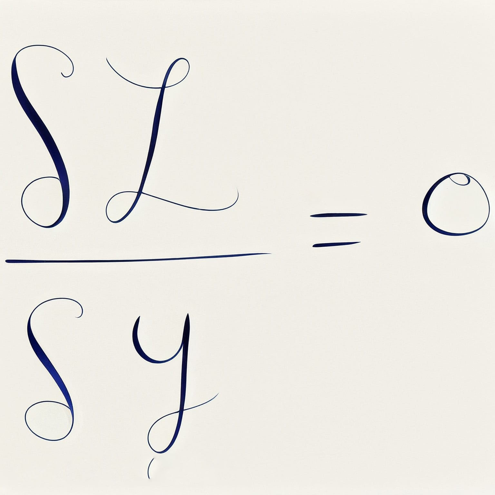
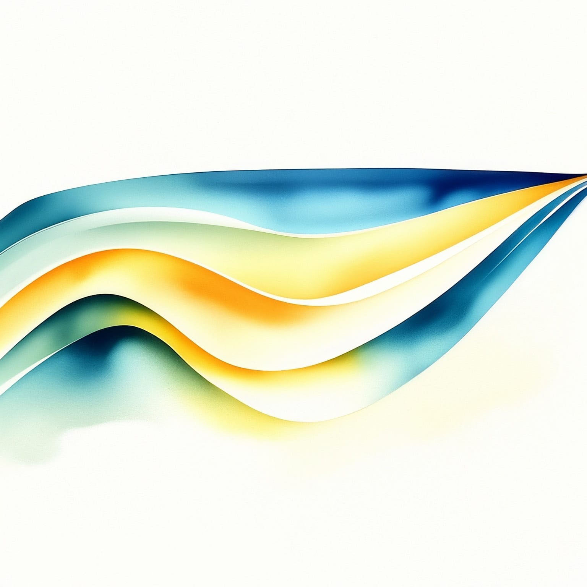

---
title: "Advanced general relativity"
subtitle: "Synthèse du cours de PHYS-F418"
toc: true
---

::: {.callout-warning appearance="minimal" collapse="true"}
## ⚠️ Avertissement concernant ces notes
Les notes publiées sur ce site sont basées sur ma compréhension personnelle du matériel et n'ont pas été indépendamment vérifiées. Bien que j'espère qu'elles soient utiles, il peut y avoir des erreurs ou des inexactitudes. Si vous trouvez des erreurs ou avez des suggestions d'amélioration, n'hésitez pas à me contacter : [a.d@csic.es](mailto:a.d@csic.es).
:::

**Enseignant :** Dr. Glenn Barnich (Année 2023-2024)  
**Ressources officielles :** 
[<i class="bi bi-link-45deg"></i> Page de l'ULB](https://www.ulb.be/fr/programme/phys-f418-1){.btn .btn-outline-light .btn-sm .ms-2}
[<i class="bi bi-folder2-open"></i> Espace Dochub](https://dochub.be/catalog/course/phys-f418){.btn .btn-outline-light .btn-sm .ms-2}

---

## Table des matières

::: {.grid}

<!-- CHAPITRE 1 -->
::: {.g-col-12 .g-col-md-4}
::: {.p-3 .rounded .shadow-sm style="background-color: var(--card-bg); border: 1px solid var(--border-flat); height: 100%; display: flex; flex-direction: column;"}
### Chapter 1: Auxiliary Fields
{.rounded .mb-3 style="width: 100%; height: auto;"}

* **1.1 Generalized auxiliary fields and symmetries**
* **1.2 Invertibility and Legendre transforms**

[<i class="bi bi-file-earmark-pdf"></i> Go to Notes](./assets/GR2/GR2-CH1.pdf){.btn-surface .c-purple .w-100 style="margin-top: auto; min-height: 40px; height: auto; padding: 8px 12px; font-size: 0.9em;"}
:::
:::

<!-- CHAPITRE 2 -->
::: {.g-col-12 .g-col-md-4}
::: {.p-3 .rounded .shadow-sm style="background-color: var(--card-bg); border: 1px solid var(--border-flat); height: 100%; display: flex; flex-direction: column;"}
### Chapter 2: Gauge Symmetry
{.rounded .mb-3 style="width: 100%; height: auto;"}

* **2.1 Introduction**
* **2.2 Mathematical tools**
* **2.3 Noether current**
* **2.4 Linearized gauge theories**

[<i class="bi bi-file-earmark-pdf"></i> Go to Notes](./assets/GR2/RG2-CH2.pdf){.btn-surface .c-purple .w-100 style="margin-top: auto; min-height: 40px; height: auto; padding: 8px 12px; font-size: 0.9em;"}
:::
:::

<!-- CHAPITRE 3 -->
::: {.g-col-12 .g-col-md-4}
::: {.p-3 .rounded .shadow-sm style="background-color: var(--card-bg); border: 1px solid var(--border-flat); height: 100%; display: flex; flex-direction: column;"}
### Chapter 3: Application to the Einstein Field Equations
{.rounded .mb-3 style="width: 100%; height: auto;"}

* **3.1 Metric formulation**

[<i class="bi bi-file-earmark-pdf"></i> Go to Notes](./assets/GR2/GR2-CH3.pdf){.btn-surface .c-purple .w-100 style="margin-top: auto; min-height: 40px; height: auto; padding: 8px 12px; font-size: 0.9em;"}
:::
:::

<!-- CHAPITRE 4 -->
::: {.g-col-12 .g-col-md-4}
::: {.p-3 .rounded .shadow-sm style="background-color: var(--card-bg); border: 1px solid var(--border-flat); height: 100%; display: flex; flex-direction: column;"}
### Chapter 4: Cartan Formalism
{.rounded .mb-3 style="width: 100%; height: auto;"}

* **4.1 Mathematical reminders**
  * Linear algebra, Manifolds, Non-coordinates basis, Covector, Change of basis, Tensor & Exterior algebra, Metric, Affine, Torsion, Levi-Civita & Lorentz connections, Curvature
  * $GL(n,\mathbb{R})$ algebra, Bianchi identities and Poincaré algebra
* **4.2 Cartan's action**
* **4.3 Einstein-Dirac theory**
* **4.4 Gravity as a Chern-Simons theory**

[<i class="bi bi-file-earmark-pdf"></i> Go to Notes](./assets/GR2/RG2-CH4.pdf){.btn-surface .c-purple .w-100 style="margin-top: auto; min-height: 40px; height: auto; padding: 8px 12px; font-size: 0.9em;"}
:::
:::

<!-- CHAPITRE 5 -->
::: {.g-col-12 .g-col-md-4}
::: {.p-3 .rounded .shadow-sm style="background-color: var(--card-bg); border: 1px solid var(--border-flat); height: 100%; display: flex; flex-direction: column;"}
### Chapter 5: ADM Formalism
{.rounded .mb-3 style="width: 100%; height: auto;"}

* **5.1 Non-null hypersurface**
* **5.2 ADM parametrization of the metric**
* **5.3 Hamiltonian formulation**
* **5.4 Hamiltonian constraint system**

[<i class="bi bi-file-earmark-pdf"></i> Go to Notes](./assets/GR2/GR2-CH5.A.pdf){.btn-surface .c-purple .w-100 style="margin-top: auto; min-height: 40px; height: auto; padding: 8px 12px; font-size: 0.9em;"}
:::
:::

<!-- CHAPITRE 6 -->
::: {.g-col-12 .g-col-md-4}
::: {.p-3 .rounded .shadow-sm style="background-color: var(--card-bg); border: 1px solid var(--border-flat); height: 100%; display: flex; flex-direction: column;"}
### Chapter 6: Hamiltonian Formulation of Linearized Gravity
{.rounded .mb-3 style="width: 100%; height: auto;"}

* **6.1 Canonical analysis and Hamiltonian formulation of linearized gravitational fields**
:::
:::

:::