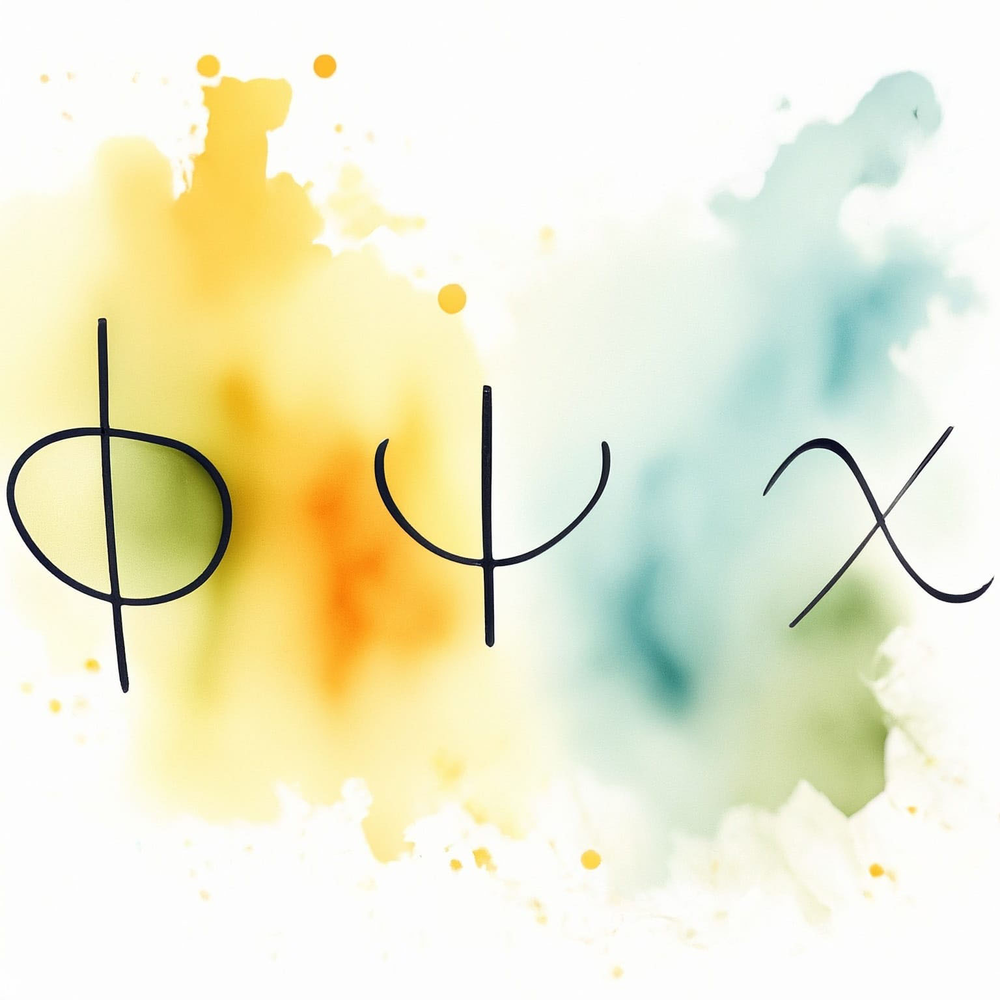

---
title: "Modèle standard des interactions fondamentales"
subtitle: "Synthèse du cours de PHYS-F422"
toc: true
---

::: {.callout-warning appearance="minimal" collapse="true"}
## ⚠️ Avertissement concernant ces notes

Les notes publiées sur ce site sont basées sur ma compréhension personnelle du matériel et n'ont pas été indépendamment vérifiées. Bien que j'espère qu'elles soient utiles, il peut y avoir des erreurs ou des inexactitudes. Si vous trouvez des erreurs ou avez des suggestions d'amélioration, n'hésitez pas à me contacter : [a.d@csic.es](mailto:a.d@csic.es).
:::

**Enseignant :** Thomas HAMBYE (Année 2023-2024)  
**Ressources officielles :** [<i class="bi bi-link-45deg"></i> Page de l'ULB](https://www.ulb.be/fr/programme/phys-f422-1){.btn .btn-outline-light .btn-sm .ms-2}
[<i class="bi bi-folder2-open"></i> Espace Dochub](https://dochub.be/catalog/course/phys-f422){.btn .btn-outline-light .btn-sm .ms-2}

---

## Table des matières

::: {.grid}

::: {.g-col-12 .g-col-md-4}
::: {.p-3 .rounded .shadow-sm style="background-color: var(--card-bg); border: 1px solid var(--border-flat); height: 100%; display: flex; flex-direction: column;"}
### Chapitre 1 : Champs élémentaires
{.rounded .mb-3 style="width: 100%; height: auto;"}

* **1.1 Champ scalaire réel**
* **1.2 Champ scalaire complexe**
* **1.3 Champ vectoriel**
* **1.4 Spineur de Dirac**
* **1.5 Spineur de Weyl sans masse**
* **1.6 Spineur de Majorana**

[<i class="bi bi-file-earmark-pdf"></i> Notes du Chapitre 1](./assets/SM/SM-CH1.pdf){.btn-surface .c-teal .w-100 style="margin-top: auto; min-height: 40px; height: auto; padding: 8px 12px; font-size: 0.9em;"}
:::
:::

::: {.g-col-12 .g-col-md-4}
::: {.p-3 .rounded .shadow-sm style="background-color: var(--card-bg); border: 1px solid var(--border-flat); height: 100%; display: flex; flex-direction: column;"}
### Chapitre 2 : Symétrie de jauge
{.rounded .mb-3 style="width: 100%; height: auto;"}

* **2.1 Cas abélien**
* **2.2 Cas non abélien: théories de Yang-Mills**

[<i class="bi bi-file-earmark-pdf"></i> Notes du Chapitre 2](./assets/SM/SM-CH2.pdf){.btn-surface .c-teal .w-100 style="margin-top: auto; min-height: 40px; height: auto; padding: 8px 12px; font-size: 0.9em;"}
:::
:::

::: {.g-col-12 .g-col-md-4}
::: {.p-3 .rounded .shadow-sm style="background-color: var(--card-bg); border: 1px solid var(--border-flat); height: 100%; display: flex; flex-direction: column;"}
### Chapitre 3 : Interaction électro-faible pour les leptons
{.rounded .mb-3 style="width: 100%; height: auto;"}

* **3.1 Leptons**
* **3.2 QED**
* **3.3 \(SU(2)\)**

[<i class="bi bi-file-earmark-pdf"></i> Notes du Chapitre 3](./assets/SM/SM-CH3.pdf){.btn-surface .c-teal .w-100 style="margin-top: auto; min-height: 40px; height: auto; padding: 8px 12px; font-size: 0.9em;"}
:::
:::

::: {.g-col-12 .g-col-md-4}
::: {.p-3 .rounded .shadow-sm style="background-color: var(--card-bg); border: 1px solid var(--border-flat); height: 100%; display: flex; flex-direction: column;"}
### Chapitre 4 : Brisure spontanée de symétrie
{.rounded .mb-3 style="width: 100%; height: auto;"}

* **4.1 Introduction: ferromagnétisme**
* **4.2 Symétrie discrète: cas d'un champ scalaire réel**
* **4.3 Symétrie globale abélienne BSS avec \( \phi \in \mathbb{R} \)**
* **4.4 Symétrie locale abélienne**
* **4.5 Symétrie locale non-abélienne**
* **4.6 BSS de \(SU(2)_L \times U(1)_Y \mapsto U(1)_{e-m}\)**
* **4.7 Symétrie custodiale**
* **4.8 Masses des leptons**
* **4.9 Renormabilité de \(SU(2)_L \times U(1)_Y\) avec BSS**

[<i class="bi bi-file-earmark-pdf"></i> Notes du Chapitre 4](./assets/SM/SM-CH4.pdf){.btn-surface .c-teal .w-100 style="margin-top: auto; min-height: 40px; height: auto; padding: 8px 12px; font-size: 0.9em;"}
:::
:::

::: {.g-col-12 .g-col-md-4}
::: {.p-3 .rounded .shadow-sm style="background-color: var(--card-bg); border: 1px solid var(--border-flat); height: 100%; display: flex; flex-direction: column;"}
### Chapitre 5 : Interaction électro-faible pour les quarks
{.rounded .mb-3 style="width: 100%; height: auto;"}

* **5.1 Zoologie**
* **5.2 Interactions faibles pour les quarks**
* **5.3 Mécanisme de GIM**
* **5.4 Paramétrisation de \(V_\text{CKM}\)**

[<i class="bi bi-file-earmark-pdf"></i> Notes du Chapitre 5](./assets/SM/SM-CH5.pdf){.btn-surface .c-teal .w-100 style="margin-top: auto; min-height: 40px; height: auto; padding: 8px 12px; font-size: 0.9em;"}
:::
:::

::: {.g-col-12 .g-col-md-4}
::: {.p-3 .rounded .shadow-sm style="background-color: var(--card-bg); border: 1px solid var(--border-flat); height: 100%; display: flex; flex-direction: column;"}
### Chapitre 6 : Processus du modèle standard
{.rounded .mb-3 style="width: 100%; height: auto;"}

* **6.1 Désintégration du boson \(W\)**
* **6.2 Forme du pic du \(Z\): \(m_Z\) et \(\Gamma_Z^\text{tot}\)**
* **6.3 Désintégration \(t \rightarrow W\,b\) et théorème d'équivalence de Goldstone**

[<i class="bi bi-file-earmark-pdf"></i> Notes du Chapitre 6](./assets/SM/SM-CH6.pdf){.btn-surface .c-teal .w-100 style="margin-top: auto; min-height: 40px; height: auto; padding: 8px 12px; font-size: 0.9em;"}
:::
:::

::: {.g-col-12 .g-col-md-4}
::: {.p-3 .rounded .shadow-sm style="background-color: var(--card-bg); border: 1px solid var(--border-flat); height: 100%; display: flex; flex-direction: column;"}
### Chapitre 7 : Chromodynamique quantique
{.rounded .mb-3 style="width: 100%; height: auto;"}

* **7.1 Introduction**
* **7.2 Commentaires**

[<i class="bi bi-file-earmark-pdf"></i> Notes du Chapitre 7](./assets/SM/SM-CH7.pdf){.btn-surface .c-teal .w-100 style="margin-top: auto; min-height: 40px; height: auto; padding: 8px 12px; font-size: 0.9em;"}
:::
:::

::: {.g-col-12 .g-col-md-4}
::: {.p-3 .rounded .shadow-sm style="background-color: var(--card-bg); border: 1px solid var(--border-flat); height: 100%; display: flex; flex-direction: column;"}
### Chapitre 8 : Symétries discrètes & brisure de \(P\), \(C\), \(T\), \(CP\)
{.rounded .mb-3 style="width: 100%; height: auto;"}

* **8.1 Définitions**
* **8.2 Transformation des spineurs sous \(C\), \(P\) et \(T\)**
* **8.3 Transformation du lagrangien sous \(C\), \(P\) et \(T\)**
* **8.4 Transformation des hadrons sous \(C\) et \(P\)**
* **8.5 Triangle d'unitarité**

[<i class="bi bi-file-earmark-pdf"></i> Notes du Chapitre 8](./assets/SM/SM-CH8.pdf){.btn-surface .c-teal .w-100 style="margin-top: auto; min-height: 40px; height: auto; padding: 8px 12px; font-size: 0.9em;"}
:::
:::

:::