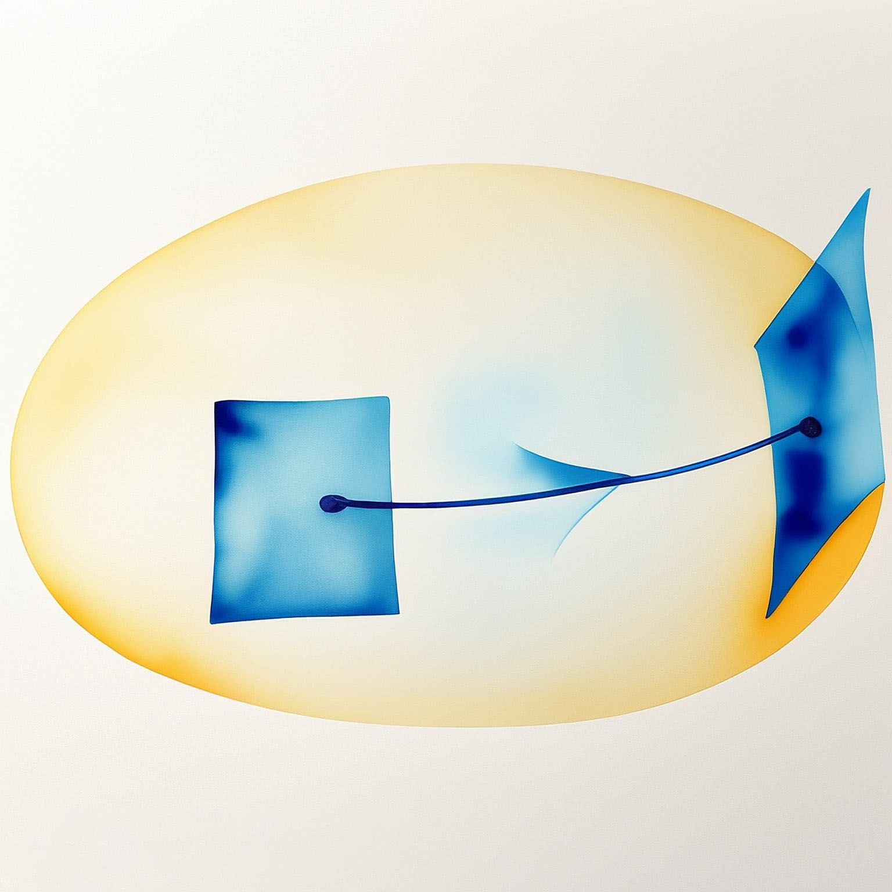
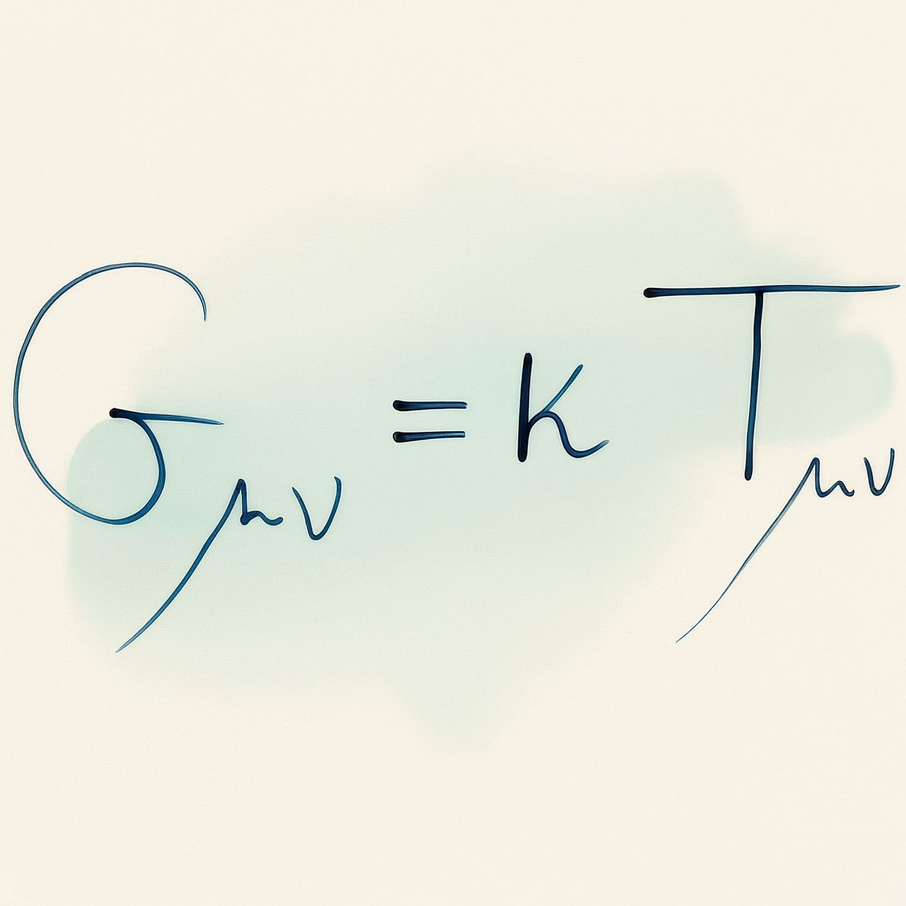

---
title: "Théorie de la gravitation"
subtitle: "Synthèse du cours de PHYS-F432"
toc: true
---

::: {.callout-warning appearance="minimal" collapse="true"}
## ⚠️ Avertissement concernant ces notes
Les notes publiées sur ce site sont basées sur ma compréhension personnelle du matériel et n'ont pas été indépendamment vérifiées. Bien que j'espère qu'elles soient utiles, il peut y avoir des erreurs ou des inexactitudes. Si vous trouvez des erreurs ou avez des suggestions d'amélioration, n'hésitez pas à me contacter : [a.d@csic.es](mailto:a.d@csic.es).
:::

**Enseignant :** Stéphane DETOURNAY (Année 2023 - 2024)  
**Ressources officielles :** 
[<i class="bi bi-link-45deg"></i> Page de l'ULB](https://www.ulb.be/fr/programme/phys-f432){.btn .btn-outline-light .btn-sm .ms-2}
[<i class="bi bi-folder2-open"></i> Espace Dochub](https://dochub.be/catalog/course/phys-f432){.btn .btn-outline-light .btn-sm .ms-2}

---

## Table des matières

::: {.grid}

<!-- Chapitre 1 -->
::: {.g-col-12 .g-col-md-4}
::: {.p-3 .rounded .shadow-sm style="background-color: var(--card-bg); border: 1px solid var(--border-flat); height: 100%; display: flex; flex-direction: column;"}
### Chapitre 1 : Introduction
{.rounded .mb-3 style="width: 100%; height: auto;"}

* **Introduction générale aux concepts de la gravitation**

[<i class="bi bi-file-earmark-pdf"></i> Notes du Chapitre 1](./assets/GR1/GR1 - CH1.pdf){.btn-surface .c-purple .w-100 style="margin-top: auto; min-height: 40px; height: auto; padding: 8px 12px; font-size: 0.9em;"}
:::
:::

<!-- Chapitre 2 -->
::: {.g-col-12 .g-col-md-4}
::: {.p-3 .rounded .shadow-sm style="background-color: var(--card-bg); border: 1px solid var(--border-flat); height: 100%; display: flex; flex-direction: column;"}
### Chapitre 2 : Rappels de relativité restreinte
{.rounded .mb-3 style="width: 100%; height: auto;"}

* **2.1 Référentiel inertiel**
* **2.2 Intervalle d'espace-temps**
* **2.3 Transformation de Lorentz de Poincaré**
* **2.4 Tenseur d'espace-temps plat**
* **2.5 Métrique minkowskienne**
* **2.6 Structure causale de l'espace-temps de Minkowski**

[<i class="bi bi-file-earmark-pdf"></i> Notes du Chapitre 2](./assets/GR1/GR1 - CH2.pdf){.btn-surface .c-purple .w-100 style="margin-top: auto; min-height: 40px; height: auto; padding: 8px 12px; font-size: 0.9em;"}
:::
:::

<!-- Chapitre 3 -->
::: {.g-col-12 .g-col-md-4}
::: {.p-3 .rounded .shadow-sm style="background-color: var(--card-bg); border: 1px solid var(--border-flat); height: 100%; display: flex; flex-direction: column;"}
### Chapitre 3 : Éléments de géométrie différentielle
{.rounded .mb-3 style="width: 100%; height: auto;"}

* **3.1 Variété différentielle**
* **3.2 Applications entre variétés**
* **3.3 Vecteurs 2.0**
* **3.4 Covecteur et tenseur**
* **3.5 Forme différentielle et dérivée extérieure**
* **3.6 Métrique**

[<i class="bi bi-file-earmark-pdf"></i> Notes du Chapitre 3](./assets/GR1/GR1 - CH3.pdf){.btn-surface .c-purple .w-100 style="margin-top: auto; min-height: 40px; height: auto; padding: 8px 12px; font-size: 0.9em;"}
:::
:::

<!-- Chapitre 4 -->
::: {.g-col-12 .g-col-md-4}
::: {.p-3 .rounded .shadow-sm style="background-color: var(--card-bg); border: 1px solid var(--border-flat); height: 100%; display: flex; flex-direction: column;"}
### Chapitre 4 : Principe d'équivalence
{.rounded .mb-3 style="width: 100%; height: auto;"}

* **4.1 Système de Coordonnées Localement Inertiel**
* **4.2 Métrique, élément de longueur et courbe**
* **4.3 Application des formes : équations de Maxwell**
* **4.4 Connexion, transport parallèle et dérivée covariante**

[<i class="bi bi-file-earmark-pdf"></i> Notes du Chapitre 4](./assets/GR1/GR1 - CH4.pdf){.btn-surface .c-purple .w-100 style="margin-top: auto; min-height: 40px; height: auto; padding: 8px 12px; font-size: 0.9em;"}
:::
:::

<!-- Chapitre 5 -->
::: {.g-col-12 .g-col-md-4}
::: {.p-3 .rounded .shadow-sm style="background-color: var(--card-bg); border: 1px solid var(--border-flat); height: 100%; display: flex; flex-direction: column;"}
### Chapitre 5 : La courbure
{.rounded .mb-3 style="width: 100%; height: auto;"}

* **5.1 Tenseur de Riemann**
* **5.2 Interprétation géométrique de $R_{\alpha \beta \gamma \delta}$**
* **5.3 Propriétés de $R_{\alpha \beta \gamma \delta}$**
* **5.4 D'autres tenseurs**
* **5.5 Géodésiques**
* **5.6 Propriétés des géodésiques**
* **5.7 Géodésiques et principe variationnel**
* **5.8 Observateur localement inertiel 2.0**
* **5.9 Géodésiques et limite newtonienne**
* **5.10 Dérivation des géodésiques et $R_{\alpha \beta \gamma \delta}$**

[<i class="bi bi-file-earmark-pdf"></i> Notes du Chapitre 5](./assets/GR1/GR1 - CH5.pdf){.btn-surface .c-purple .w-100 style="margin-top: auto; min-height: 40px; height: auto; padding: 8px 12px; font-size: 0.9em;"}
:::
:::

<!-- Chapitre 6 -->
::: {.g-col-12 .g-col-md-4}
::: {.p-3 .rounded .shadow-sm style="background-color: var(--card-bg); border: 1px solid var(--border-flat); height: 100%; display: flex; flex-direction: column;"}
### Chapitre 6 : Vers les équations d'Einstein
{.rounded .mb-3 style="width: 100%; height: auto;"}

* **6.1 Méthode heuristique**
* **6.2 Limite newtonienne**
* **6.3 Principe variationnel**

[<i class="bi bi-file-earmark-pdf"></i> Notes du Chapitre 6](./assets/GR1/GR1 - CH6.pdf){.btn-surface .c-purple .w-100 style="margin-top: auto; min-height: 40px; height: auto; padding: 8px 12px; font-size: 0.9em;"}
:::
:::

<!-- Chapitre 7 -->
::: {.g-col-12 .g-col-md-4}
::: {.p-3 .rounded .shadow-sm style="background-color: var(--card-bg); border: 1px solid var(--border-flat); height: 100%; display: flex; flex-direction: column;"}
### Chapitre 7 : Solution de Schwarzschild
{.rounded .mb-3 style="width: 100%; height: auto;"}

* **7.1 Préliminaires**
* **7.2 Construction d'une $g_{\mu \nu}$ sphérique**
* **7.3 Métrique solution des équations d'Einstein dans le vide**
* **7.4 Singularités de la métrique**
* **7.5 Géodésiques de la métrique de Schwarzschild**

[<i class="bi bi-file-earmark-pdf"></i> Notes du Chapitre 7](./assets/GR1/GR1 - CH7.pdf){.btn-surface .c-purple .w-100 style="margin-top: auto; min-height: 40px; height: auto; padding: 8px 12px; font-size: 0.9em;"}
:::
:::

<!-- Chapitre 8 -->
::: {.g-col-12 .g-col-md-4}
::: {.p-3 .rounded .shadow-sm style="background-color: var(--card-bg); border: 1px solid var(--border-flat); height: 100%; display: flex; flex-direction: column;"}
### Chapitre 8 : Vers le trou noir
{.rounded .mb-3 style="width: 100%; height: auto;"}

* **8.1 Orientation des cônes de lumière**
* **8.2 Observateurs statiques près de $r=2m$**
* **8.3 Redshift gravitationnel**
* **8.4 Chute libre**
* **8.5 Structure globale de la métrique de Schwarzschild**
* **8.6 Effondrement gravitationnel**

[<i class="bi bi-file-earmark-pdf"></i> Notes du Chapitre 8](./assets/GR1/GR1 - CH8.pdf){.btn-surface .c-purple .w-100 style="margin-top: auto; min-height: 40px; height: auto; padding: 8px 12px; font-size: 0.9em;"}
:::
:::

:::

---

## Ressources du cours

### Exercices - intro et rappels
* [Exercice 1 : intro et rappels](./assets/GR1/TP/TP1 - intro et rappels.pdf)
* [Exercice 2 : intro et rappels](./assets/GR1/TP/TP2 - intro et rappels.pdf)
* [Exercice 3 : aide-mémoire](./assets/GR1/TP/TP3 - aide-mémoire.pdf)
* [Exercice 4 : aide-mémoire](./assets/GR1/TP/TP4 - aide-mémoire.pdf)
* [Exercice 5 : aide-mémoire](./assets/GR1/TP/TP5 - aide-mémoire.pdf)

### Exercices - énoncés
* [Exercice 1 : énoncés](./assets/GR1/TP/TP1 - énoncés.pdf)
* [Exercice 2 : énoncés](./assets/GR1/TP/TP2 - énoncés.pdf)
* [Exercice 3 : énoncés](./assets/GR1/TP/TP3 - énoncés.pdf)
* [Exercice 4 : énoncés](./assets/GR1/TP/TP4 - énoncés.pdf)
* [Exercice 5 : énoncés](./assets/GR1/TP/TP5 - énoncés.pdf)
* [Exercice 6 : énoncés](./assets/GR1/TP/TP6 - énoncés.pdf)

### Exercices - correctifs
* [Exercice 1 : correctif](./assets/GR1/TP/TP1 - correctif.pdf)
* [Exercice 2 : correctif](./assets/GR1/TP/TP2 - correctif.pdf)
* [Exercice 3 : correctif](./assets/GR1/TP/TP3 - correctif.pdf)
* [Exercice 4 : correctif](./assets/GR1/TP/TP4 - correctif.pdf)
* [Exercice 5 : correctif](./assets/GR1/TP/TP5 - correctif.pdf)
* [Exercice 6 : correctif](./assets/GR1/TP/TP6 - correctif.pdf)

### Travail personnel
* [Énoncé](./assets/GR1/Travail.pdf)
* [Travail personnel (Rendu)](./assets/GR1/Travail_adierckx.pdf)
* [Correctif partiel](./assets/GR1/Correction Question B - Devoir.pdf)