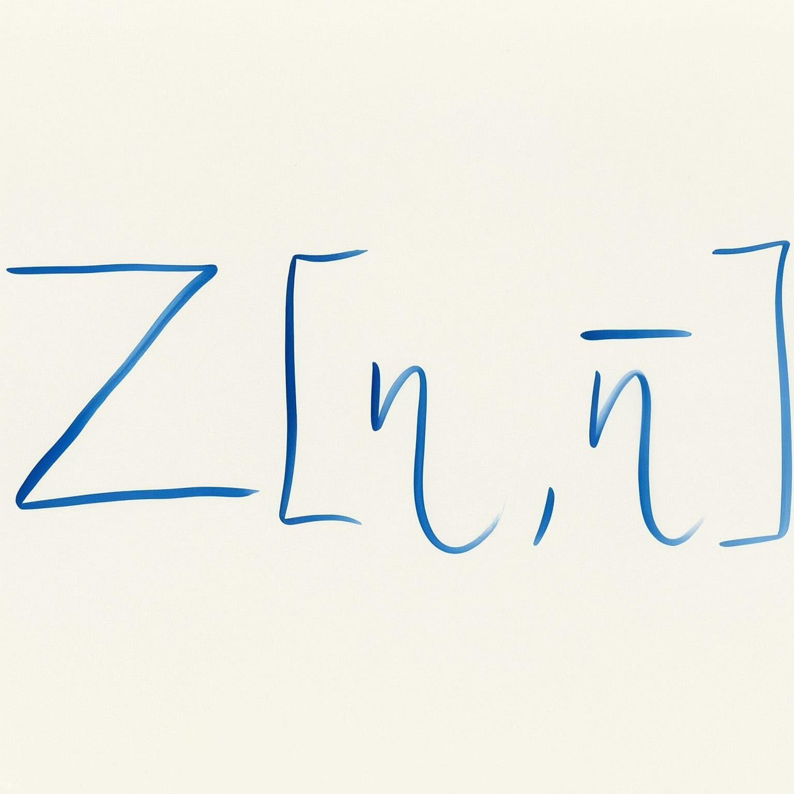
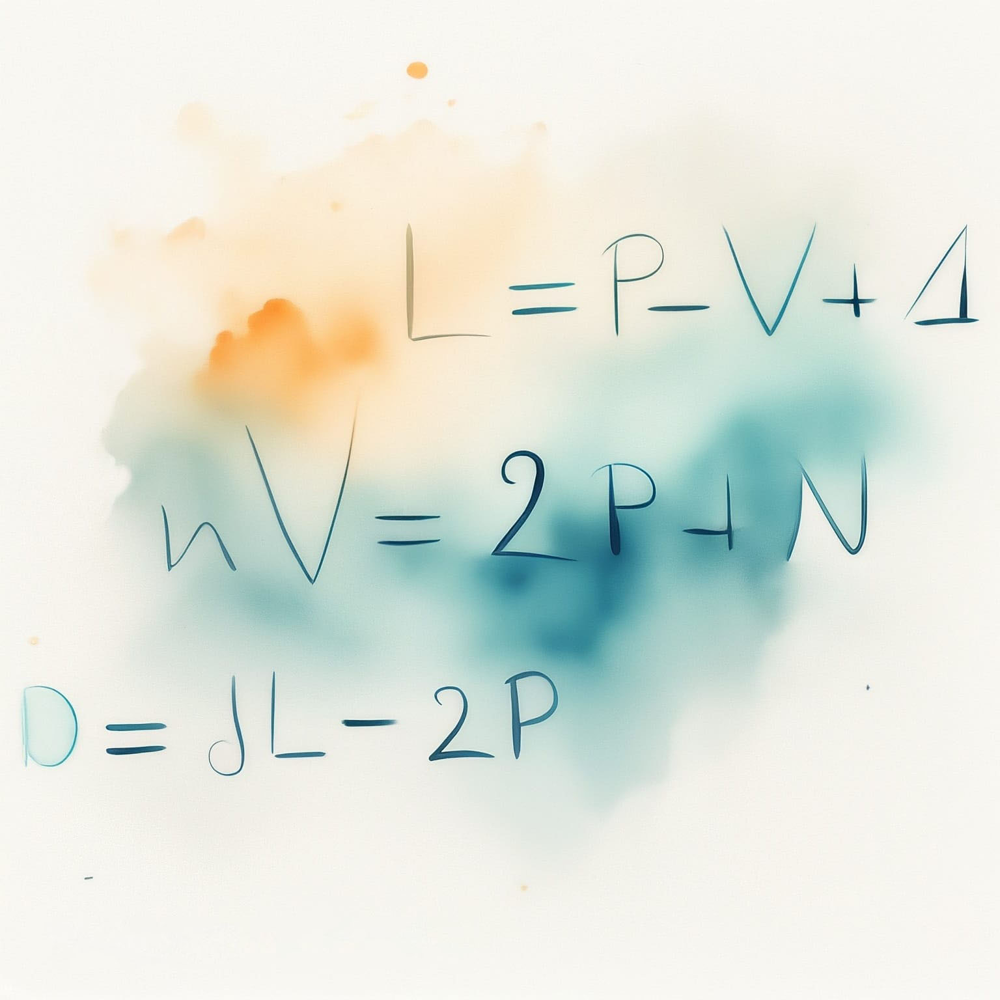
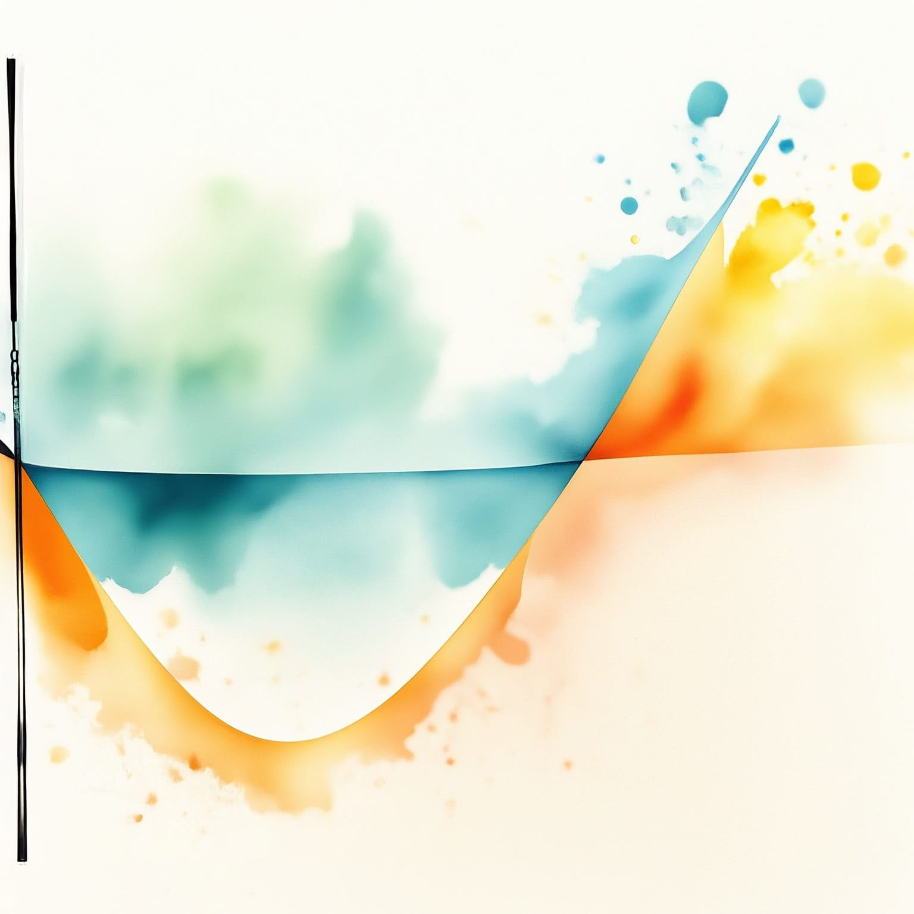

---
title: "Quantum Field Theory II"
subtitle: "Synthèse du cours de PHYS-F440"
toc: true
---

::: {.callout-warning appearance="minimal" collapse="true"}
## ⚠️ Avertissement concernant ces notes
Les notes publiées sur ce site sont basées sur ma compréhension personnelle du matériel et n'ont pas été indépendamment vérifiées. Bien que j'espère qu'elles soient utiles, il peut y avoir des erreurs ou des inexactitudes. Si vous trouvez des erreurs ou avez des suggestions d'amélioration, n'hésitez pas à me contacter : [a.d@csic.es](mailto:a.d@csic.es).
:::

**Enseignant :** Riccardo ARGURIO (Année 2023-2024)  
**Ressources officielles :** [<i class="bi bi-link-45deg"></i> Page de l'ULB](https://www.ulb.be/en/programme/phys-f440-1){.btn .btn-outline-light .btn-sm .ms-2}
[<i class="bi bi-folder2-open"></i> Espace Dochub](https://dochub.be/catalog/course/phys-f440){.btn .btn-outline-light .btn-sm .ms-2}

---

## Table des matières

::: {.grid}

::: {.g-col-12 .g-col-md-4}
::: {.p-3 .rounded .shadow-sm style="background-color: var(--card-bg); border: 1px solid var(--border-flat); height: 100%; display: flex; flex-direction: column;"}
### Chapitre 1 : Path Integral Formulation of Quantum Mechanics
{.rounded .mb-3 style="width: 100%; height: auto;"}

* **1.1 Recall of Quantum Mechanics**
* **1.2 Operators and Representation**
* **1.3 Amplitude**
* **1.4 Canonical Hamiltonian and Gaussian Integrals**
* **1.5 Operators under the Path Integral**
* **1.6 Towards Field Theory**

[<i class="bi bi-file-earmark-pdf"></i> Notes du Chapitre 1](./assets/QFT2/QFT2-CH1.pdf){.btn-surface .c-purple .w-100 style="margin-top: auto; min-height: 40px; height: auto; padding: 8px 12px; font-size: 0.9em;"}
:::
:::

::: {.g-col-12 .g-col-md-4}
::: {.p-3 .rounded .shadow-sm style="background-color: var(--card-bg); border: 1px solid var(--border-flat); height: 100%; display: flex; flex-direction: column;"}
### Chapitre 2 : Path Integral for a Scalar Field Theory
{.rounded .mb-3 style="width: 100%; height: auto;"}

* **2.1 Formal Definition of QFT**
* **2.2 Free Real Scalar Theory**
* **2.3 Real Scalar Field with Interactions**

[<i class="bi bi-file-earmark-pdf"></i> Notes du Chapitre 2](./assets/QFT2/QFT2-CH2.pdf){.btn-surface .c-purple .w-100 style="margin-top: auto; min-height: 40px; height: auto; padding: 8px 12px; font-size: 0.9em;"}
:::
:::

::: {.g-col-12 .g-col-md-4}
::: {.p-3 .rounded .shadow-sm style="background-color: var(--card-bg); border: 1px solid var(--border-flat); height: 100%; display: flex; flex-direction: column;"}
### Chapitre 3 : Path Integral for a Fermionic Field
{.rounded .mb-3 style="width: 100%; height: auto;"}

* **3.1 Anticommuting Numbers**
* **3.2 Dirac Propagator and Generating Functional**
* **3.3 Interacting Fermions**

[<i class="bi bi-file-earmark-pdf"></i> Notes du Chapitre 3](./assets/QFT2/QFT2-CH3.pdf){.btn-surface .c-purple .w-100 style="margin-top: auto; min-height: 40px; height: auto; padding: 8px 12px; font-size: 0.9em;"}
:::
:::

::: {.g-col-12 .g-col-md-4}
::: {.p-3 .rounded .shadow-sm style="background-color: var(--card-bg); border: 1px solid var(--border-flat); height: 100%; display: flex; flex-direction: column;"}
### Chapitre 4 : Path Integral for a Vector Field
{.rounded .mb-3 style="width: 100%; height: auto;"}

* **4.1 Gauge Freedom**
* **4.2 Faddeev-Popov Procedure**
* **4.3 Adding Sources**
* **4.4 Example: QED**
* **4.5 Scalar QED**

[<i class="bi bi-file-earmark-pdf"></i> Notes du Chapitre 4](./assets/QFT2/QFT2-CH4.pdf){.btn-surface .c-purple .w-100 style="margin-top: auto; min-height: 40px; height: auto; padding: 8px 12px; font-size: 0.9em;"}
:::
:::

::: {.g-col-12 .g-col-md-4}
::: {.p-3 .rounded .shadow-sm style="background-color: var(--card-bg); border: 1px solid var(--border-flat); height: 100%; display: flex; flex-direction: column;"}
### Chapitre 5 : Symmetries, Ward Identity, and the Path Integral
{.rounded .mb-3 style="width: 100%; height: auto;"}

* **5.1 Noether Theorem**
* **5.2 Quantum Conservation Equations**
* **5.3 Quantum Equation of Motion**

[<i class="bi bi-file-earmark-pdf"></i> Notes du Chapitre 5](./assets/QFT2/QFT2-CH5.pdf){.btn-surface .c-purple .w-100 style="margin-top: auto; min-height: 40px; height: auto; padding: 8px 12px; font-size: 0.9em;"}
:::
:::

::: {.g-col-12 .g-col-md-4}
::: {.p-3 .rounded .shadow-sm style="background-color: var(--card-bg); border: 1px solid var(--border-flat); height: 100%; display: flex; flex-direction: column;"}
### Chapitre 6 : Physics of Renormalization
{.rounded .mb-3 style="width: 100%; height: auto;"}

* **6.1 A First Computation: 2-point Function in $\lambda \phi^4$**
* **6.2 A Second Computation: Vertex in $\lambda \phi^4$**
* **6.3 A Third Computation: $\mathcal{L}_I = g\, \phi \bar{\psi}\psi$**

[<i class="bi bi-file-earmark-pdf"></i> Notes du Chapitre 6](./assets/QFT2/QFT2-CH6.pdf){.btn-surface .c-purple .w-100 style="margin-top: auto; min-height: 40px; height: auto; padding: 8px 12px; font-size: 0.9em;"}
:::
:::

::: {.g-col-12 .g-col-md-4}
::: {.p-3 .rounded .shadow-sm style="background-color: var(--card-bg); border: 1px solid var(--border-flat); height: 100%; display: flex; flex-direction: column;"}
### Chapitre 7 : Radiative Corrections: Loops and Divergences
{.rounded .mb-3 style="width: 100%; height: auto;"}

* **7.1 Field-strength Renormalization**
* **7.2 Physical and Bare Quantities**
* **7.3 LSZ Reduction Formula**

[<i class="bi bi-file-earmark-pdf"></i> Notes du Chapitre 7](./assets/QFT2/QFT2-CH7.pdf){.btn-surface .c-purple .w-100 style="margin-top: auto; min-height: 40px; height: auto; padding: 8px 12px; font-size: 0.9em;"}
:::
:::

::: {.g-col-12 .g-col-md-4}
::: {.p-3 .rounded .shadow-sm style="background-color: var(--card-bg); border: 1px solid var(--border-flat); height: 100%; display: flex; flex-direction: column;"}
### Chapitre 8 : Power Counting, Divergences, and Renormalizability
{.rounded .mb-3 style="width: 100%; height: auto;"}

* **8.1 Example: $\lambda \phi^4$ Theory**
* **8.2 Power Counting**
* **8.3 Renormalizability**

[<i class="bi bi-file-earmark-pdf"></i> Notes du Chapitre 8](./assets/QFT2/QFT2-CH8.pdf){.btn-surface .c-purple .w-100 style="margin-top: auto; min-height: 40px; height: auto; padding: 8px 12px; font-size: 0.9em;"}
:::
:::

::: {.g-col-12 .g-col-md-4}
::: {.p-3 .rounded .shadow-sm style="background-color: var(--card-bg); border: 1px solid var(--border-flat); height: 100%; display: flex; flex-direction: column;"}
### Chapitre 9 : Counter-terms and Renormalization Condition
{.rounded .mb-3 style="width: 100%; height: auto;"}

* **9.1 Renormalized Perturbation Theory**
* **9.2 Renormalization Conditions**
* **9.3 Fix $\delta_\lambda$ through NLO of a 4-points Function**
* **9.4 Dimensional Regularization**
* **9.5 Field Strength and Mass Renormalization**

[<i class="bi bi-file-earmark-pdf"></i> Notes du Chapitre 9](./assets/QFT2/QFT2-CH9.pdf){.btn-surface .c-purple .w-100 style="margin-top: auto; min-height: 40px; height: auto; padding: 8px 12px; font-size: 0.9em;"}
:::
:::

::: {.g-col-12 .g-col-md-4}
::: {.p-3 .rounded .shadow-sm style="background-color: var(--card-bg); border: 1px solid var(--border-flat); height: 100%; display: flex; flex-direction: column;"}
### Chapitre 10 : Renormalization and Gauge Symmetry: QED
{.rounded .mb-3 style="width: 100%; height: auto;"}

* **10.1 Counterterms and Gauge Symmetry**
* **10.2 Counterterms and Ward Identity**
* **10.3 One-loop Structure of QED**

[<i class="bi bi-file-earmark-pdf"></i> Notes du Chapitre 10](./assets/QFT2/QFT2-CH10.pdf){.btn-surface .c-purple .w-100 style="margin-top: auto; min-height: 40px; height: auto; padding: 8px 12px; font-size: 0.9em;"}
:::
:::

::: {.g-col-12 .g-col-md-4}
::: {.p-3 .rounded .shadow-sm style="background-color: var(--card-bg); border: 1px solid var(--border-flat); height: 100%; display: flex; flex-direction: column;"}
### Chapitre 11 : Energy Scale and Evolution of Couplings
{.rounded .mb-3 style="width: 100%; height: auto;"}

* **11.1 Renormalization Scale $\bar{M}$**
* **11.2 The Callan-Symanzik Equation**
* **11.3 Computation of $\beta$ and $\gamma$ in $\lambda \phi^4$**
* **11.4 Generalization to $\lambda \phi^4$**
* **11.5 An Application to QED**
* **11.6 Renormalization Group Flow**

[<i class="bi bi-file-earmark-pdf"></i> Notes du Chapitre 11](./assets/QFT2/QFT2-CH11.pdf){.btn-surface .c-purple .w-100 style="margin-top: auto; min-height: 40px; height: auto; padding: 8px 12px; font-size: 0.9em;"}
:::
:::

::: {.g-col-12 .g-col-md-4}
::: {.p-3 .rounded .shadow-sm style="background-color: var(--card-bg); border: 1px solid var(--border-flat); height: 100%; display: flex; flex-direction: column;"}
### Chapitre 12 : Non-Abelian Gauge Theories
{.rounded .mb-3 style="width: 100%; height: auto;"}

* **12.1 Global Symmetry**
* **12.2 Local Symmetry**
* **12.3 Field Strength Tensor**
* **12.4 Yang-Mills Lagrangian**

[<i class="bi bi-file-earmark-pdf"></i> Notes du Chapitre 12](./assets/QFT2/QFT2-CH12.pdf){.btn-surface .c-purple .w-100 style="margin-top: auto; min-height: 40px; height: auto; padding: 8px 12px; font-size: 0.9em;"}
:::
:::

::: {.g-col-12 .g-col-md-4}
::: {.p-3 .rounded .shadow-sm style="background-color: var(--card-bg); border: 1px solid var(--border-flat); height: 100%; display: flex; flex-direction: column;"}
### Chapitre 13 : Quantization and Ghosts
{.rounded .mb-3 style="width: 100%; height: auto;"}

* **13.1 Gauge Fixing in QED**
* **13.2 Gauge Fixing in QCD**
* **13.3 Faddeev-Popov Ghost**
* **13.4 Feynman Rules**

[<i class="bi bi-file-earmark-pdf"></i> Notes du Chapitre 13](./assets/QFT2/QFT2-CH13.pdf){.btn-surface .c-purple .w-100 style="margin-top: auto; min-height: 40px; height: auto; padding: 8px 12px; font-size: 0.9em;"}
:::
:::

::: {.g-col-12 .g-col-md-4}
::: {.p-3 .rounded .shadow-sm style="background-color: var(--card-bg); border: 1px solid var(--border-flat); height: 100%; display: flex; flex-direction: column;"}
### Chapitre 14 : Renormalization and $\text{sgn}(\beta)$
{.rounded .mb-3 style="width: 100%; height: auto;"}

* **14.1 Renormalization**
* **14.2 A Long Walk to the $\beta$-function**
* **14.3 Asymptotic Freedom**

[<i class="bi bi-file-earmark-pdf"></i> Notes du Chapitre 14](./assets/QFT2/QFT2-CH14.pdf){.btn-surface .c-purple .w-100 style="margin-top: auto; min-height: 40px; height: auto; padding: 8px 12px; font-size: 0.9em;"}
:::
:::

:::