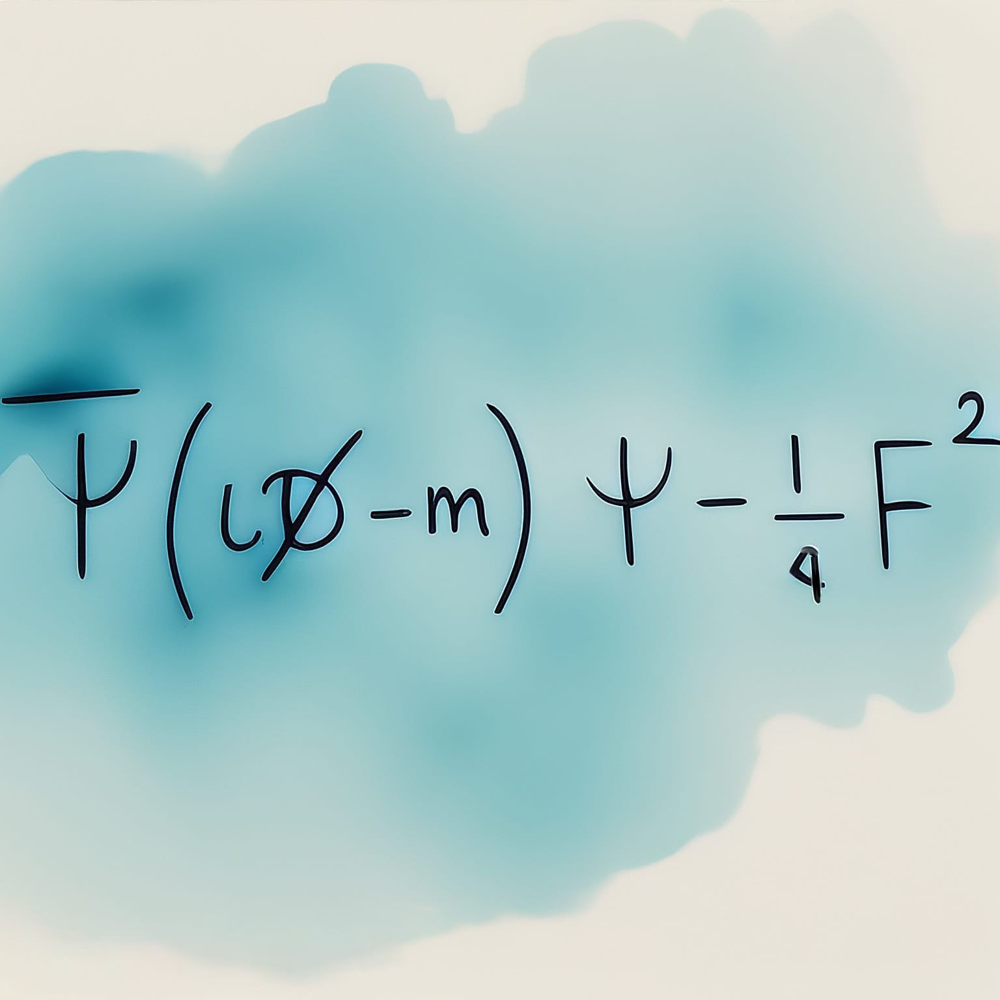

---
title: "Physics of Strong Interactions"
subtitle: "Synthèse du cours de PHYS-F477"
toc: true
---

::: {.callout-warning appearance="minimal" collapse="true"}
## ⚠️ Avertissement concernant ces notes

Les notes publiées sur ce site sont basées sur ma compréhension
personnelle du matériel et n'ont pas été indépendamment vérifiées. Bien
que j'espère qu'elles soient utiles, il peut y avoir des erreurs ou des
ineactitudes. Si vous trouvez des erreurs ou avez des suggestions
d'amélioration, n'hésitez pas à me contacter :
[a.d@csic.es](mailto:a.d@csic.es).
:::

**Enseignant :** Laurent FAVART (Année 2023-2024)  
**Ressources officielles :**  
[<i class="bi bi-link-45deg"></i> Page de l'ULB](https://www.ulb.be/fr/programme/phys-f477-1){.btn .btn-outline-light .btn-sm .ms-2}  
[<i class="bi bi-folder2-open"></i> Espace Dochub](https://dochub.be/catalog/course/phys-f477){.btn .btn-outline-light .btn-sm .ms-2}  

---

## Table des matières

::: {.grid}

<!-- Chapitre 1 -->
::: {.g-col-12 .g-col-md-4}
::: {.p-3 .rounded .shadow-sm style="background-color: var(--card-bg); border: 1px solid var(--border-flat); height: 100%; display: flex; flex-direction: column;"}
### Chapitre 1 : Introduction
{.rounded .mb-3 style="width: 100%; height: auto;"}

* **1.1 Un brin d'histoire**

[<i class="bi bi-file-earmark-pdf"></i> Notes du Chapitre 1](./assets/QCD/QCD-CH1.pdf){.btn-surface .c-teal .w-100 style="margin-top: auto; min-height: 40px; height: auto; padding: 8px 12px; font-size: 0.9em;"}
:::
:::

<!-- Chapitre 2 -->
::: {.g-col-12 .g-col-md-4}
::: {.p-3 .rounded .shadow-sm style="background-color: var(--card-bg); border: 1px solid var(--border-flat); height: 100%; display: flex; flex-direction: column;"}
### Chapitre 2 : Bases de la QCD
{.rounded .mb-3 style="width: 100%; height: auto;"}

* **2.1 Introduction**
* **2.2 Invariance de jauge en QED**
* **2.3 Invariance de jauge non-abélienne et lagrangien de QCD**
* **2.4 La liberté asymptotique**
* **2.5 Le potentiel QCD**

[<i class="bi bi-file-earmark-pdf"></i> Notes du Chapitre 2](./assets/QCD/QCD-CH2.pdf){.btn-surface .c-teal .w-100 style="margin-top: auto; min-height: 40px; height: auto; padding: 8px 12px; font-size: 0.9em;"}
:::
:::

<!-- Chapitre 3 -->
::: {.g-col-12 .g-col-md-4}
::: {.p-3 .rounded .shadow-sm style="background-color: var(--card-bg); border: 1px solid var(--border-flat); height: 100%; display: flex; flex-direction: column;"}
### Chapitre 3 : Annihilation $e^+-e^-$
{.rounded .mb-3 style="width: 100%; height: auto;"}

* **3.1 Section efficace totale $e^+-e^- \rightarrow \text{hadrons}$**
* **3.2 Création d'une paire $\bar{q}q$**
* **3.3 La formation de jets**
* **3.4 Le pic du $Z$**
* **3.5 Corrections radiatives QED**
* **3.6 Au delà du $Z$**
* **3.7 Production de particules**
* **3.8 $\sigma \left( e^+ e^- \rightarrow q \bar{q} g\right)$**
* **3.9 Algorithmes de reconstruction des jets**
* **3.10 Structure de l'état final hadronique**
* **3.11 Comparaison des mesures de $\alpha_s$**
* **3.12 Test de la structure de jauge de QCD**

[<i class="bi bi-file-earmark-pdf"></i> Notes du Chapitre 3](./assets/QCD/QCD-CH3.pdf){.btn-surface .c-teal .w-100 style="margin-top: auto; min-height: 40px; height: auto; padding: 8px 12px; font-size: 0.9em;"}
:::
:::

<!-- Chapitre 4 -->
::: {.g-col-12 .g-col-md-4}
::: {.p-3 .rounded .shadow-sm style="background-color: var(--card-bg); border: 1px solid var(--border-flat); height: 100%; display: flex; flex-direction: column;"}
### Chapitre 4 : La diffusion $e^--p$
{.rounded .mb-3 style="width: 100%; height: auto;"}

* **4.1 De l'atome au nucléon**
* **4.2 Diffusion spin $1/2$ sur nucléon**
* **4.3 Diffusion profondément inélastique**
* **4.4 Les fonctions de structure**
* **4.5 Le modèle des partons**
* **4.6 Mesure étendue des fonctions de structures**
* **4.7 La violation d'échelle et les équations $\text{DGLAP}$**

[<i class="bi bi-file-earmark-pdf"></i> Notes du Chapitre 4](./assets/QCD/QCD-CH4.pdf){.btn-surface .c-teal .w-100 style="margin-top: auto; min-height: 40px; height: auto; padding: 8px 12px; font-size: 0.9em;"}
:::
:::

<!-- Chapitre 5 -->
::: {.g-col-12 .g-col-md-4}
::: {.p-3 .rounded .shadow-sm style="background-color: var(--card-bg); border: 1px solid var(--border-flat); height: 100%; display: flex; flex-direction: column;"}
### Chapitre 5 : Interactions proton-proton
{.rounded .mb-3 style="width: 100%; height: auto;"}

* **5.1 Production de jets**
* **5.2 Remarque sur les factorisations QCD**
* **5.3 Le processus Drell-Yan**
* **5.4 Conclusion**

[<i class="bi bi-file-earmark-pdf"></i> Notes du Chapitre 5](./assets/QCD/QCD-CH5.pdf){.btn-surface .c-teal .w-100 style="margin-top: auto; min-height: 40px; height: auto; padding: 8px 12px; font-size: 0.9em;"}
:::
:::

:::