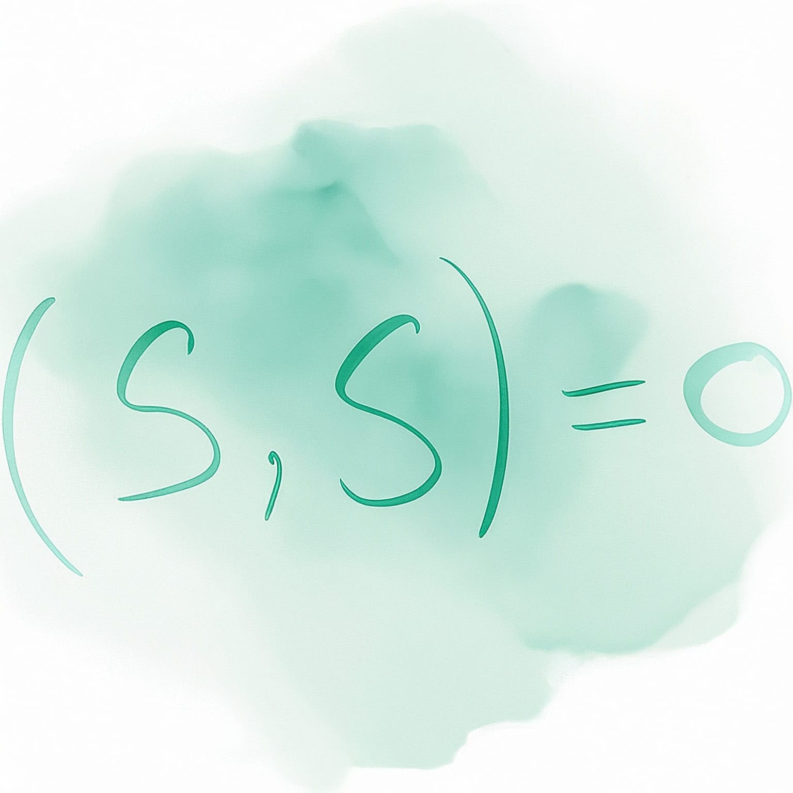

---
title: "Advanced Quantum Field Theory"
subtitle: "Synthèse du cours de PHYS-F417"
toc: true
---

::: {.callout-warning appearance="minimal" collapse="true"}
## ⚠️ Avertissement concernant ces notes
Les notes publiées sur ce site sont basées sur ma compréhension personnelle du matériel et n'ont pas été indépendamment vérifiées. Bien que j'espère qu'elles soient utiles, il peut y avoir des erreurs ou des inexactitudes. Si vous trouvez des erreurs ou avez des suggestions d'amélioration, n'hésitez pas à me contacter : [a.d@csic.es](mailto:a.d@csic.es).
:::

**Enseignant :** Dr. Glenn Barnich (Année 2024-2025)  
**Ressources officielles :** 
[<i class="bi bi-link-45deg"></i> Page de l'ULB](https://www.ulb.be/en/programme/phys-f417){.btn .btn-outline-light .btn-sm .ms-2}
[<i class="bi bi-folder2-open"></i> Espace Dochub](https://dochub.be/catalog/course/phys-f417){.btn .btn-outline-light .btn-sm .ms-2}

---

## Table des matières

::: {.grid}

<!-- CHAPITRE 1 -->
::: {.g-col-12 .g-col-md-4}
::: {.p-3 .rounded .shadow-sm style="background-color: var(--card-bg); border: 1px solid var(--border-flat); height: 100%; display: flex; flex-direction: column;"}
### Chapter 1: Canonical Quantization of Free Fields
{.rounded .mb-3 style="width: 100%; height: auto;"}

* **Topics covered:**
  * 1.1 Canonical Quantization of Electromagnetic Fields
  * 1.2 Partition Function and Thermodynamics

[<i class="bi bi-file-earmark-pdf"></i> Go to Notes](./assets/AQFT/AQFT - CH1.pdf){.btn-surface .c-teal .w-100 style="margin-top: auto; min-height: 40px; height: auto; padding: 8px 12px; font-size: 0.9em;"}
:::
:::

<!-- CHAPITRE 2 -->
::: {.g-col-12 .g-col-md-4}
::: {.p-3 .rounded .shadow-sm style="background-color: var(--card-bg); border: 1px solid var(--border-flat); height: 100%; display: flex; flex-direction: column;"}
### Chapter 2: Path Integrals
{.rounded .mb-3 style="width: 100%; height: auto;"}

* **Topics covered:**
  * 2.1 Hamiltonian formulation
  * 2.2 Partition function
  * 2.3 Semi-classical expansion of $Z(\beta)$
  * 2.4 Holomorphic representation
  * 2.5 Reduction formulas
  * 2.6 Finite temperature results

[<i class="bi bi-file-earmark-pdf"></i> Go to Notes](./assets/AQFT/AQFT - CH2.pdf){.btn-surface .c-teal .w-100 style="margin-top: auto; min-height: 40px; height: auto; padding: 8px 12px; font-size: 0.9em;"}
:::
:::

<!-- CHAPITRE 3 -->
::: {.g-col-12 .g-col-md-4}
::: {.p-3 .rounded .shadow-sm style="background-color: var(--card-bg); border: 1px solid var(--border-flat); height: 100%; display: flex; flex-direction: column;"}
### Chapter 3: Functional Methods
{.rounded .mb-3 style="width: 100%; height: auto;"}

* **Topics covered:**
  * 3.1 Generating functional for connected Green's function
  * 3.2 Effective action

[<i class="bi bi-file-earmark-pdf"></i> Go to Notes](./assets/AQFT/AQFT - CH3.pdf){.btn-surface .c-teal .w-100 style="margin-top: auto; min-height: 40px; height: auto; padding: 8px 12px; font-size: 0.9em;"}
:::
:::

<!-- CHAPITRE 4 -->
::: {.g-col-12 .g-col-md-4}
::: {.p-3 .rounded .shadow-sm style="background-color: var(--card-bg); border: 1px solid var(--border-flat); height: 100%; display: flex; flex-direction: column;"}
### Chapter 4: Renormalization and Asymptotic Behavior
{.rounded .mb-3 style="width: 100%; height: auto;"}

* **Topics covered:**
  * 4.1 Casimir effect
  * 4.2 1-loop effective action for scalar field

[<i class="bi bi-file-earmark-pdf"></i> Go to Notes](./assets/AQFT/AQFT - CH4.pdf){.btn-surface .c-teal .w-100 style="margin-top: auto; min-height: 40px; height: auto; padding: 8px 12px; font-size: 0.9em;"}
:::
:::

<!-- CHAPITRE 5 -->
::: {.g-col-12 .g-col-md-4}
::: {.p-3 .rounded .shadow-sm style="background-color: var(--card-bg); border: 1px solid var(--border-flat); height: 100%; display: flex; flex-direction: column;"}
### Chapter 5: Quantum Gauge Field
{.rounded .mb-3 style="width: 100%; height: auto;"}

* **Topics covered:**
  * 5.1 Gauge invariance
  * 5.2 BRST invariance
  * 5.3 Gauge fixation and propagators
  * 5.4 Vanishing of Chern-Simons $\beta$-function
  * 5.5 Gauge independence and Zinn-Justin equation

[<i class="bi bi-file-earmark-pdf"></i> Go to Notes](./assets/AQFT/AQFT - CH5.pdf){.btn-surface .c-teal .w-100 style="margin-top: auto; min-height: 40px; height: auto; padding: 8px 12px; font-size: 0.9em;"}
:::
:::

:::

---

## Formalisme des antichamps et cohomologie BRST

*Documentation supplémentaire basée sur le cours du Collège de France de Marc Henneaux.*

::: {.grid}

<!-- BRST CHAPITRE 1 -->
::: {.g-col-12 .g-col-md-6}
::: {.p-3 .rounded .shadow-sm style="background-color: var(--card-bg); border: 1px solid var(--border-flat); height: 100%; display: flex; flex-direction: column;"}
### Chapitre 1 : Principes généraux
{.rounded .mb-3 style="width: 100%; height: auto;"}

* **Sujets abordés :**
  * 1.1 Introduction
  * 1.2 Description des symétries de jauge

[<i class="bi bi-file-earmark-pdf"></i> Go to Notes](./assets/AQFT/BRST - CH1.pdf){.btn-surface .c-teal .w-100 style="margin-top: auto; min-height: 40px; height: auto; padding: 8px 12px; font-size: 0.9em;"}
:::
:::

<!-- BRST CHAPITRE 2 -->
::: {.g-col-12 .g-col-md-6}
::: {.p-3 .rounded .shadow-sm style="background-color: var(--card-bg); border: 1px solid var(--border-flat); height: 100%; display: flex; flex-direction: column;"}
### Chapitre 2 : Équations maëtresses
{.rounded .mb-3 style="width: 100%; height: auto;"}

* **Sujets abordés :**
  * 2.1 Algèbre différentielle graduée - (Co)homologie
  * 2.2 Champs fantômes et antichamps
  * 2.3 Équation maîtresse classique
  * 2.4 Yang-Mills et secteur non minimal
  * 2.5 Amplitudes de transition & valeurs moyennes
  * 2.6 Équation maîtresse quantique
  * 2.7 Déformations cohérentes des théories de jauge
  * 2.8 Valeurs moyennes d'observables
  * 2.9 Cohomologie locale

[<i class="bi bi-file-earmark-pdf"></i> Go to Notes](./assets/AQFT/BRST - CH2.pdf){.btn-surface .c-teal .w-100 style="margin-top: auto; min-height: 40px; height: auto; padding: 8px 12px; font-size: 0.9em;"}
:::
:::

:::

---

## Course Resources

### Syllabus
* [Notes on Quantum Field Theory](./assets/AQFT/Ressources/aQFT_Notes.pdf)

### Exercices
* [Exercices 1](./assets/AQFT/Ressources/TP%201/TP%201.pdf)
* [Exercices 2](./assets/AQFT/Ressources/TP%202/exercise2+sol.pdf)
* [Exercices 3](./assets/AQFT/Ressources/TP%203/exercise3+sol.pdf)
* [Exercices 4](./assets/AQFT/Ressources/TP%204/exercise4.pdf)
* [Exercices 5](./assets/AQFT/Ressources/TP%205/exercise5.pdf)

### Additional References
* [Handbook of mathematical functions with formulas, graphs, and mathematical tables](/Ressources/Mathematics/Handbook%20of%20mathematical%20functions%20with%20formulas,%20graphs,%20and%20mathematical%20tables%20(Abramowitz,%20Milton%20(editor)%20Stegun%20etc.).pdf) — *Abramowitz, Milton, Stegun, Irena A.*
* [Quantum Field Theory and Critical Phenomena](/Ressources/QuantumFieldTheory/Quantum%20Field%20Theory%20and%20Critical%20Phenomena%20(Jean%20Zinn-Justin).pdf) — *Jean Zinn-Justin*
* [Quantization of Gauge Systems](/Ressources/QuantumFieldTheory/Quantization%20of%20Gauge%20Systems%20(Marc%20Henneaux%20Claudio%20Teitelboim).pdf) — *Marc Henneaux, Claudio Teitelboim*